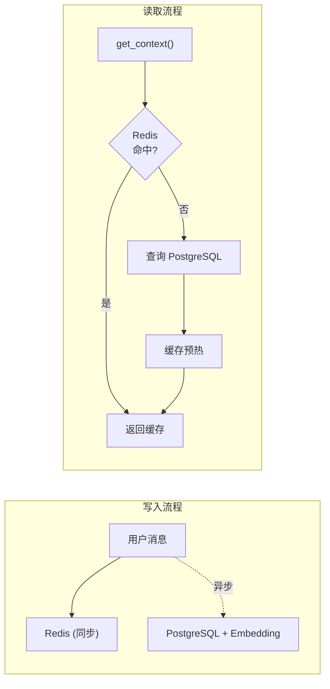

<div align="center">

# 🍜 XHS Food Agent

**小红书美食智能推荐 Agent** — 让"找吃的"变得更聪明

[](https://www.python.org/)
[](https://fastapi.tiangolo.com/)
[](https://www.langchain.com/)
[](https://redis.io/)
[](https://www.postgresql.org/)
[](LICENSE)

<p align="center">
  <strong>🔍 智能搜索 · 🎯 本地推荐 · ❌ 过滤网红 · 💬 多轮对话 · 🧠 长期记忆</strong>
</p>

---

*一个基于 LLM 的智能美食推荐系统，通过分析小红书社区真实用户评论，*  
*识别本地人推荐的隐藏美食，过滤网红流量店，帮你找到真正值得打卡的美食。*

</div>

---

## ✨ 核心特性

<table>
<tr>
<td width="50%">

### 🧠 智能分析引擎
- **4阶段搜索策略** — 广撒网、挖隐藏、定向验证、细分搜索
- **评论权重系统** — 识别本地人 vs 游客的真实评价
- **网红店过滤** — 自动识别并过滤过度营销内容

</td>
<td width="50%">

### � 混合记忆系统
- **Redis (L1)** — 短期上下文，滑动窗口
- **PostgreSQL (L2)** — 长期持久化 + pgvector 向量检索
- **智能缓存预热** — 自动恢复历史对话

</td>
</tr>
<tr>
<td width="50%">

### �🚀 生产就绪
- **SSE 流式输出** — 实时获取搜索进度
- **会话管理 API** — 完整的多用户支持
- **FastAPI 服务** — 简洁 RESTful API

</td>
<td width="50%">

### 🔧 灵活配置
- **多 LLM 支持** — SiliconFlow / OpenAI / DeepSeek
- **独立 Embedding** — 可配置专用向量模型
- **优雅降级** — 组件缺失时自动 fallback

</td>
</tr>
</table>

---

## 🛠️ 技术架构

```
┌──────────────────────────────────────────────────────────────────────┐
│                         XHS Food Agent                                │
├──────────────────────────────────────────────────────────────────────┤
│  ┌──────────────┐   ┌─────────────────┐   ┌────────────────────────┐ │
│  │   FastAPI    │───│  SessionManager │───│   Multi-Agent System   │ │
│  │ (SSE + REST) │   │  (会话编排器)    │   │  Intent │ Analyzer    │ │
│  └──────────────┘   └─────────────────┘   └────────────────────────┘ │
│         │                  │    │                     │              │
│         ▼                  ▼    ▼                     ▼              │
│  ┌─────────────┐   ┌───────────────────────────┐  ┌───────────────┐ │
│  │   Redis     │   │      PostgreSQL           │  │  LLM Service  │ │
│  │ (L1 Cache)  │   │  + pgvector (L2 Storage)  │  │ (SiliconFlow) │ │
│  └─────────────┘   └───────────────────────────┘  └───────────────┘ │
│                              │                            │          │
│                              ▼                            ▼          │
│  ┌───────────────────────────────────────────────────────────────┐  │
│  │                      XHS Spider                                │  │
│  │          (Search · Note Content · Comments Scraping)           │  │
│  └───────────────────────────────────────────────────────────────┘  │
└──────────────────────────────────────────────────────────────────────┘
```

---

## 🚀 快速开始

### 1️⃣ 克隆项目

```bash
git clone https://github.com/your-username/xhs-food-agent.git
cd xhs-food-agent
```

### 2️⃣ 配置环境变量

```bash
cp .env.example .env
```

编辑 `.env` 文件，配置以下项目：

| 变量 | 必需 | 说明 |
|------|:----:|------|
| `XHS_COOKIES` | ✅ | 小红书登录 Cookie |
| `OPENAI_API_KEY` | ✅ | LLM API 密钥 |
| `OPENAI_API_BASE` | ✅ | API 基础地址 |
| `REDIS_HOST` | ❌ | Redis 地址（可选，fallback 到内存） |
| `POSTGRES_HOST` | ❌ | PostgreSQL 地址（可选，长期存储） |
| `EMBEDDING_API_KEY` | ❌ | Embedding API 密钥（可选，向量搜索） |

### 3️⃣ 安装依赖

```bash
# 创建虚拟环境
python -m venv .venv
.\.venv\Scripts\activate  # Windows
source .venv/bin/activate  # Linux/Mac

# 安装依赖
pip install -e .
```

### 4️⃣ 启动服务

```bash
uvicorn src.api.main:app --reload --port 8000
```

🎉 **服务已启动!** 访问 http://localhost:8000/docs 查看 API 文档

---

## 📡 API 接口

### 搜索接口

```bash
# 普通搜索
curl -X POST http://localhost:8000/api/v1/search \
  -H "Content-Type: application/json" \
  -d '{"query": "成都本地人常去的老火锅"}'

# SSE 流式搜索 (推荐)
curl -N "http://localhost:8000/api/v1/search/stream?query=成都春熙路附近早餐推荐"
```

### 会话管理

```bash
# 创建新会话
curl -X POST http://localhost:8000/api/v1/session/create

# 获取会话信息
curl http://localhost:8000/api/v1/session/{session_id}

# 获取完整历史
curl http://localhost:8000/api/v1/session/{session_id}/history

# 重置会话
curl -X POST "http://localhost:8000/api/v1/reset?session_id={session_id}"
```

<details>
<summary>📋 <strong>完整 API 端点列表</strong></summary>

| 方法 | 端点 | 说明 |
|------|------|------|
| `GET` | `/health` | 健康检查 |
| `POST` | `/api/v1/search` | 同步搜索（支持 session_id） |
| `GET` | `/api/v1/search/stream` | SSE 流式搜索 |
| `POST` | `/api/v1/session/create` | 创建新会话 |
| `GET` | `/api/v1/session/{id}` | 获取会话信息 |
| `GET` | `/api/v1/session/{id}/history` | 获取完整历史 |
| `POST` | `/api/v1/reset` | 重置会话上下文 |

</details>

---

## 📂 项目结构

```
xhs_food_agent/
├── 📁 src/
│   ├── 📁 api/                    # FastAPI 服务层
│   │   ├── main.py               # 应用入口
│   │   ├── routes.py             # API 路由（含会话管理）
│   │   └── schemas.py            # 请求/响应模型
│   │
│   └── 📁 xhs_food/              # 核心 Agent 模块
│       ├── orchestrator.py       # 🎯 主编排器
│       ├── schemas.py            # 数据模型定义
│       ├── state.py              # Agent 状态管理
│       │
│       ├── 📁 agents/            # 子 Agent
│       │   ├── intent_parser.py  # 意图解析 Agent
│       │   └── analyzer.py       # 结果分析 Agent
│       │
│       ├── 📁 services/          # 💾 核心服务
│       │   ├── llm_service.py    # LLM 服务封装
│       │   ├── redis_memory.py   # Redis L1 缓存
│       │   ├── postgres_storage.py  # PostgreSQL L2 存储
│       │   └── session_manager.py   # 会话统一管理
│       │
│       ├── 📁 spider/            # XHS 爬虫组件
│       ├── 📁 prompts/           # Prompt 模板
│       ├── 📁 providers/         # 工具提供者
│       └── 📁 protocols/         # 协议定义
│
├── 📁 tests/                     # 测试用例
├── .env.example                  # 环境变量模板
├── pyproject.toml                # 项目配置
└── README.md                     # 项目说明
```

---

## 💾 会话管理架构

系统采用 **Redis + PostgreSQL** 混合记忆架构：



| 组件 | 用途 | 特点 |
|------|------|------|
| **Redis** | L1 缓存 | 滑动窗口、24h TTL、毫秒级响应 |
| **PostgreSQL** | L2 存储 | 永久保存、pgvector 向量搜索 |
| **SessionManager** | 编排层 | 双写策略、缓存预热、优雅降级 |

---

## 🔧 高级配置

### 完整环境变量

```bash
# ========== LLM API ==========
OPENAI_API_KEY="sk-xxx"
OPENAI_API_BASE="https://api.siliconflow.cn/v1/"
DEFAULT_LLM_MODEL="Qwen/Qwen3-8B"

# ========== Redis (可选) ==========
REDIS_HOST=localhost
REDIS_PORT=6379
REDIS_DATABASE=0
REDIS_PASSWORD=

# ========== PostgreSQL (可选) ==========
POSTGRES_HOST=localhost
POSTGRES_PORT=5432
POSTGRES_DB=xhs_food_agent
POSTGRES_USER=postgres
POSTGRES_PASSWORD=

# ========== Embedding API (可选) ==========
EMBEDDING_API_KEY="sk-xxx"
EMBEDDING_API_BASE="https://api.openai.com/v1/"
EMBEDDING_MODEL="text-embedding-3-small"
```

### 支持的 LLM 提供商

| 提供商 | API Base | 推荐模型 |
|--------|----------|----------|
| SiliconFlow | `https://api.siliconflow.cn/v1/` | `Qwen/Qwen3-8B` |
| OpenAI | `https://api.openai.com/v1/` | `gpt-4o-mini` |
| DeepSeek | `https://api.deepseek.com/v1/` | `deepseek-chat` |

---

## 📋 开发计划

- [x] 基础多轮对话支持
- [x] SSE 流式输出
- [x] 评论权重分析系统
- [x] Redis 会话缓存
- [x] PostgreSQL 持久化存储
- [x] pgvector 向量搜索
- [ ] 地理位置感知 (GPS 推荐)
- [ ] 用户偏好学习
- [ ] Web UI 界面
- [ ] Docker 部署支持

---

## 🤝 贡献

欢迎贡献代码、提交 Issue 或建议！

1. Fork 本仓库
2. 创建你的特性分支 (`git checkout -b feature/AmazingFeature`)
3. 提交你的更改 (`git commit -m 'Add some AmazingFeature'`)
4. 推送到分支 (`git push origin feature/AmazingFeature`)
5. 打开一个 Pull Request

---

## ⚠️ 免责声明

本项目仅供学习和研究使用。使用本项目获取小红书数据时，请遵守：

- 小红书服务条款和使用规范
- 相关法律法规
- 合理的请求频率限制

请勿将本项目用于商业用途或任何可能损害小红书平台利益的行为。

---

## 🙏 致谢

本项目的小红书数据采集能力基于以下优秀开源项目：

<table>
<tr>
<td align="center">
<a href="https://github.com/cv-cat/Spider_XHS">
<br/>
<strong>Spider_XHS</strong>
</a>
<br/>
<sub>小红书逆向爬虫 · 为本项目提供核心数据采集能力</sub>
<br/>
<sub>感谢 <a href="https://github.com/cv-cat">@cv-cat</a> 的辛勤付出 ❤️</sub>
</td>
</tr>
</table>

---

## 📄 License

本项目采用 [MIT License](LICENSE) 开源协议。

---

<div align="center">

**如果这个项目对你有帮助，请给一个 ⭐ Star 支持一下！**

Made with ❤️

</div>
