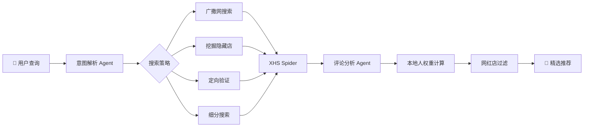

<div align="center">

# 🍜 XHS Food Agent

**小红书美食智能推荐 Agent** — 让"找吃的"变得更聪明

[](https://www.python.org/)
[](https://fastapi.tiangolo.com/)
[](https://www.langchain.com/)
[](LICENSE)

<p align="center">
  <strong>🔍 智能搜索 · 🎯 本地推荐 · ❌ 过滤网红 · 💬 多轮对话</strong>
</p>

---

*一个基于 LLM 的智能美食推荐系统，通过分析小红书社区真实用户评论，*
*识别本地人推荐的隐藏美食，过滤网红流量店，帮你找到真正值得打卡的美食。*

</div>

---

## ✨ 核心特性

<table>
<tr>
<td width="50%">

### 🧠 智能分析引擎
- **4阶段搜索策略** — 广撒网、挖隐藏、定向验证、细分搜索
- **评论权重系统** — 识别本地人 vs 游客的真实评价
- **网红店过滤** — 自动识别并过滤过度营销内容

</td>
<td width="50%">

### 🚀 开箱即用
- **SSE 流式输出** — 实时获取搜索进度
- **多轮对话支持** — 过滤、扩展、详情查询
- **FastAPI 服务** — 简洁 RESTful API

</td>
</tr>
</table>

---

## 🛠️ 技术架构

```
┌─────────────────────────────────────────────────────────────┐
│                     XHS Food Agent                          │
├─────────────────────────────────────────────────────────────┤
│  ┌─────────────┐  ┌─────────────┐  ┌──────────────────────┐ │
│  │   FastAPI   │──│ Orchestrator│──│  Multi-Agent System  │ │
│  │   (SSE)     │  │   (Core)    │  │  Intent │ Analyzer   │ │
│  └─────────────┘  └─────────────┘  └──────────────────────┘ │
│         │                │                    │             │
│         ▼                ▼                    ▼             │
│  ┌─────────────────────────────────────────────────────────┐│
│  │                    LLM Service                          ││
│  │         (SiliconFlow Qwen / OpenAI Compatible)          ││
│  └─────────────────────────────────────────────────────────┘│
│         │                                                   │
│         ▼                                                   │
│  ┌─────────────────────────────────────────────────────────┐│
│  │                   XHS Spider                            ││
│  │      (Search · Note Content · Comments Scraping)        ││
│  └─────────────────────────────────────────────────────────┘│
└─────────────────────────────────────────────────────────────┘
```

---

## 🚀 快速开始

### 1️⃣ 克隆项目

```bash
git clone https://github.com/your-username/xhs-food-agent.git
cd xhs-food-agent
```

### 2️⃣ 配置环境变量

```bash
cp .env.example .env
```

编辑 `.env` 文件，配置以下必需项：

| 变量 | 说明 | 获取方式 |
|------|------|----------|
| `XHS_COOKIES` | 小红书登录 Cookie | 浏览器登录后从开发者工具获取 |
| `OPENAI_API_KEY` | LLM API 密钥 | 默认支持 SiliconFlow |
| `OPENAI_API_BASE` | API 基础地址 | 默认为 SiliconFlow 地址 |

### 3️⃣ 安装依赖

```bash
# 推荐使用 uv (更快)
uv sync

# 或使用 pip
pip install -e .
```

### 4️⃣ 启动服务

```bash
uv run uvicorn src.api.main:app --reload --port 8000
```

🎉 **服务已启动!** 访问 http://localhost:8000/docs 查看 API 文档

---

## 📡 API 使用

### 普通搜索

```bash
curl -X POST http://localhost:8000/api/v1/search \
  -H "Content-Type: application/json" \
  -d '{
    "query": "成都本地人常去的老火锅",
    "session_id": "optional-session-id"
  }'
```

### SSE 流式搜索 (推荐)

```bash
curl -N "http://localhost:8000/api/v1/search/stream?query=成都春熙路附近早餐推荐"
```

<details>
<summary>📋 <strong>完整 API 端点列表</strong></summary>

| 方法 | 端点 | 说明 |
|------|------|------|
| `GET` | `/health` | 健康检查 |
| `POST` | `/api/v1/search` | 同步搜索 |
| `GET` | `/api/v1/search/stream` | SSE 流式搜索 |

</details>

---

## 📂 项目结构

```
xhs_food_agent/
├── 📁 src/
│   ├── 📁 api/                    # FastAPI 服务层
│   │   ├── main.py               # 应用入口
│   │   └── routes/               # API 路由
│   │
│   └── 📁 xhs_food/              # 核心 Agent 模块
│       ├── orchestrator.py       # 🎯 主编排器
│       ├── schemas.py            # 数据模型定义
│       ├── state.py              # Agent 状态管理
│       │
│       ├── 📁 agents/            # 子 Agent
│       │   ├── intent_parser.py  # 意图解析 Agent
│       │   └── analyzer.py       # 结果分析 Agent
│       │
│       ├── 📁 spider/            # XHS 爬虫组件
│       │   ├── core.py           # 爬虫核心
│       │   ├── search.py         # 搜索功能
│       │   └── note.py           # 笔记获取
│       │
│       ├── 📁 prompts/           # Prompt 模板
│       ├── 📁 providers/         # 服务提供者
│       └── 📁 services/          # 业务服务
│
├── 📁 tests/                     # 测试用例
├── .env.example                  # 环境变量模板
├── pyproject.toml                # 项目配置
└── README.md                     # 项目说明
```

---

## 🎯 工作原理



---

## 🔧 高级配置

### 自定义 LLM 模型

默认使用 SiliconFlow 的 Qwen3-8B 模型。你可以在 `.env` 中更换为其他兼容 OpenAI API 的模型：

```bash
# 使用 OpenAI 官方
OPENAI_API_KEY="sk-xxx"
OPENAI_API_BASE="https://api.openai.com/v1/"
DEFAULT_LLM_MODEL="gpt-4o-mini"

# 使用 DeepSeek
OPENAI_API_KEY="sk-xxx"
OPENAI_API_BASE="https://api.deepseek.com/v1/"
DEFAULT_LLM_MODEL="deepseek-chat"
```

---

## 📋 开发计划

- [x] 基础多轮对话支持
- [x] SSE 流式输出
- [x] 评论权重分析系统
- [ ] 地理位置感知 (GPS 推荐)
- [ ] 用户偏好学习
- [ ] Web UI 界面
- [ ] Docker 部署支持

---

## 🤝 贡献

欢迎贡献代码、提交 Issue 或建议！

1. Fork 本仓库
2. 创建你的特性分支 (`git checkout -b feature/AmazingFeature`)
3. 提交你的更改 (`git commit -m 'Add some AmazingFeature'`)
4. 推送到分支 (`git push origin feature/AmazingFeature`)
5. 打开一个 Pull Request

---

## ⚠️ 免责声明

本项目仅供学习和研究使用。使用本项目获取小红书数据时，请遵守：

- 小红书服务条款和使用规范
- 相关法律法规
- 合理的请求频率限制

请勿将本项目用于商业用途或任何可能损害小红书平台利益的行为。

---

## � 致谢

本项目的小红书数据采集能力基于以下优秀开源项目：

<table>
<tr>
<td align="center">
<a href="https://github.com/cv-cat/Spider_XHS">
<br/>
<strong>Spider_XHS</strong>
</a>
<br/>
<sub>小红书逆向爬虫 · 为本项目提供核心数据采集能力</sub>
<br/>
<sub>感谢 <a href="https://github.com/cv-cat">@cv-cat</a> 的辛勤付出 ❤️</sub>
</td>
</tr>
</table>

---

## �📄 License

本项目采用 [MIT License](LICENSE) 开源协议。

---

<div align="center">

**如果这个项目对你有帮助，请给一个 ⭐ Star 支持一下！**

Made with ❤️ by [Your Name]

</div>
