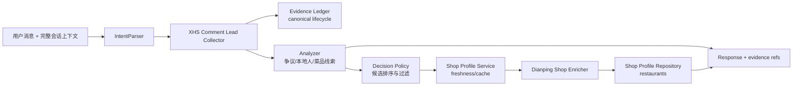

<div align="center">

# 🍜 XHS Food Agent

**小红书美食智能推荐 Agent** — 让"找吃的"变得更聪明

[](https://www.python.org/)
[](https://fastapi.tiangolo.com/)
[](https://ai.pydantic.dev/)
[](https://temporal.io/)
[](https://redis.io/)
[](https://www.postgresql.org/)
[](LICENSE)

<p align="center">
  <strong>🔍 智能搜索 · 🎯 本地推荐 · ❌ 过滤网红 · 💬 多轮对话 · 🧠 长期记忆</strong>
</p>

---

*一个基于 LLM 的智能美食推荐系统，通过分析小红书评论证据，*
*识别本地人推荐的隐藏美食，过滤网红流量店，帮你找到真正值得打卡的美食。*

<br/>

**[🚀 快速开始](#-快速开始) · [📖 文档](#-文档) · [💡 特性](#-核心特性) · [🤝 贡献](#-贡献)**

</div>

---

## 🎯 为什么选择 XHS Food Agent？

<table>
<tr>
<td width="50%">

### 😤 传统方式的痛点

- ❌ 搜"成都火锅"返回千篇一律的网红店
- ❌ 分不清哪些是真实推荐，哪些是广告软文
- ❌ 本地人私藏的宝藏店铺难以发现
- ❌ 需要翻阅大量笔记和评论

</td>
<td width="50%">

### 😊 我们的解决方案

- ✅ AI 智能分析评论，识别本地人口碑店
- ✅ 多维度信任评分，自动过滤营销内容
- ✅ 评论优先取证，再用大众点评补齐店铺资料
- ✅ 一句话搜索，秒出靠谱推荐

</td>
</tr>
</table>

---

## ✨ 核心特性

<table>
<tr>
<td width="50%">

### 🧠 智能分析引擎
- **评论优先取证** — 从小红书评论中的纠正、争议和本地人线索发现候选店
- **店铺档案补全** — 通过大众点评店铺档案补充地址、坐标、图片、菜品和活动
- **评论权重系统** — 识别本地人 vs 游客的真实评价
- **网红店过滤** — 自动识别并过滤过度营销内容

</td>
<td width="50%">

### 💾 混合记忆系统
- **Redis (L1)** — 短期上下文，滑动窗口
- **PostgreSQL (L2)** — 长期持久化 + pgvector 向量检索
- **智能缓存预热** — 自动恢复历史对话

</td>
</tr>
<tr>
<td width="50%">

### 🚀 生产就绪
- **SSE 流式输出** — 实时获取搜索进度
- **断线恢复** — 无感重连，数据不丢失
- **多用户支持** — 完整的会话管理 API

</td>
<td width="50%">

### 🔧 灵活配置
- **OpenAI-compatible LLM** — 可选择 gpt-5.6-sol 等受控模型
- **独立 Embedding** — 可配置专用向量模型
- **明确失败语义** — MCP、策略或账号上下文缺失时 fail-closed

</td>
</tr>
</table>

---

## 🎬 Demo 演示

<details>
<summary>📱 <strong>点击展开使用示例</strong></summary>

### 示例查询

```bash
# 1. 基础搜索
"成都本地人常去的老火锅"

# 2. 带偏好的搜索
"上海浦东机场附近，适合商务宴请的餐厅，预算 500 以内"

# 3. 追问对话
"还有便宜点的吗？" / "有没有排队少的？"
```

### 返回结果示例

```json
{
  "name": "蜀大侠火锅",
  "trustScore": 8.5,
  "oneLiner": "本地人推荐的老火锅，锅底正宗不踩雷",
  "pros": ["锅底正宗", "服务热情", "性价比高"],
  "cons": ["高峰期需排队"],
  "mustTry": [{"name": "毛肚", "reason": "招牌必点"}],
  "stats": {
    "flavor": "A",
    "cost": "$$",
    "wait": "15min"
  }
}
```

</details>

---

## 🛠️ 技术架构

Agent 的外部数据能力只来自托管 Account Service MCP。主应用不包含平台
Spider、签名器、浏览器登录、Cookie 或本地 provider。

```
┌──────────────────────────────────────────────────────────────────────┐
│                         XHS Food Agent                                │
├──────────────────────────────────────────────────────────────────────┤
│  ┌──────────────┐   ┌─────────────────┐   ┌────────────────────────┐ │
│  │   FastAPI    │───│  SessionManager │───│   Multi-Agent System   │ │
│  │ (SSE + REST) │   │  (会话编排器)    │   │  Intent │ Analyzer    │ │
│  └──────────────┘   └─────────────────┘   └────────────────────────┘ │
│         │                  │    │                     │              │
│         ▼                  ▼    ▼                     ▼              │
│  ┌─────────────┐   ┌───────────────────────────┐  ┌───────────────┐ │
│  │   Redis     │   │      PostgreSQL           │  │  LLM Service  │ │
│  │ (L1 Cache)  │   │  + pgvector (L2 Storage)  │  │ (OpenAI-compatible) │ │
│  └─────────────┘   └───────────────────────────┘  └───────────────┘ │
│         ┌────────────────────────────┴───────────────────────┐    │
│         ▼                                                    ▼    │
│  ┌────────────────────┐                         ┌────────────────┐ │
│  │ Agent Tool Catalog │── tools/list + policy ──│ Account Service│ │
│  │ + Pinned Executor  │── tools/call + context ─│ MCP            │ │
│  └────────────────────┘                         └────────────────┘ │
└──────────────────────────────────────────────────────────────────────┘
```

### Agent 内部流程


```mermaid
flowchart LR
    A[用户消息 + 完整会话上下文] --> B[IntentParser]
    B --> C[XHS Comment Lead Collector]
    C --> D[Evidence Ledger<br/>canonical lifecycle]
    C --> E[Analyzer<br/>争议/本地人/菜品线索]
    E --> F[Decision Policy<br/>候选排序与过滤]
    F --> G[Shop Profile Service<br/>freshness/cache]
    G --> H[Dianping Shop Enricher]
    H --> I[Shop Profile Repository<br/>restaurants]
    E --> J[Response + evidence refs]
    I --> J
```

---

## 🔌 托管 Account Service 与 MCP

账号状态和平台 SDK 由独立上游服务拥有：`xhs-account-service` 负责
`xhs_pc`/`xhs_creator`，`dianping-account-service` 负责 `dianping`。主应用通过
`src/xhs_food/contracts/account_service.py` 和
`src/xhs_food/gateways/account_service.py` 的 HTTP/MCP 适配层调用它们，不导入
上游 Python 包，也不保存 Cookie、浏览器 profile、二维码字节或 signer 状态。
只需在 `MODULAR_ACCOUNT_SERVICES_FILE` 或 `MODULAR_ACCOUNT_SERVICES_JSON` 中写入
两个服务的 URL、频道、能力白名单和 `auth_ref`，Composition Root 会在启动时刷新
能力并按频道路由。HTTP 是账号/登录资源的权威边界；Agent 搜索只通过 MCP 的
`tools/list` 与 `tools/call` 发现和执行经过双重 allow-list 的只读工具。部署示例与完整 endpoint 清单见
[`docs/account-services.md`](docs/account-services.md) 和
[`docker-compose.account-services.yml`](docker-compose.account-services.yml)。
Agent 原生工具另有一层默认拒绝的应用策略
`MODULAR_AGENT_MCP_TOOL_POLICY_JSON`；只有策略允许的只读能力会以
`xhs_pc__notes_search` 这类稳定名称暴露给模型，登录和写操作不会自动暴露。

### 启用步骤

在 `.env` 中配置两个服务的地址、MCP endpoint 与明确的工具放行策略：

```dotenv
MODULAR_ACCOUNT_SERVICES_JSON='[{"service_id":"xhs-account","base_url":"http://XHS_HOST","mcp_url":"http://XHS_HOST/mcp","protocol":"http+mcp","channels":["xhs_pc","xhs_creator"]},{"service_id":"dianping-account","base_url":"http://DP_HOST","mcp_url":"http://DP_HOST/mcp","protocol":"http+mcp","channels":["dianping"]}]'
MODULAR_AGENT_MCP_TOOL_POLICY_JSON='{"enabled":true,"allowed_platforms":["xhs_pc","dianping"],"allowed_capabilities":["notes.search","notes.detail","comments.search","places.search","places.detail","reviews.search"]}'
```

应用启动时刷新远端 descriptor 和 `tools/list`。`GET /v1/platform/readiness`
显示远端服务的脱敏状态；策略、服务或请求账号上下文缺失时搜索直接失败。

### 账号登录与 re-auth

1. `POST /v1/platform/accounts` 注册一个 `(tenant_id, platform, account_ref)`，
   账号初始为 `pending_login`。
2. `xhs_pc`/`xhs_creator` 登录命令由对应 Account Service 执行：
   `POST /v1/platform/accounts/{platform}/{account_ref}/login/qr` 创建短期 QR 流程，
   `GET /v1/platform/login/{flow_id}/qr` 只返回限时展示引用，`POST .../poll` 推进状态。
3. 也可通过 `/login` 使用 `CREDENTIAL_REF`；主应用只转发不透明引用，不接收
   Cookie、二维码内容、storage-state 或 signer 输入。
4. 账号隔离、session 版本与风控状态由远端服务负责；主应用只持有账号引用。

生产/商业启用还需要 owner/legal/security 的审批、真实 disposable-account canary
和 aggregate evidence；本地 fixture/合约测试不等同于生产批准。

## 🚀 快速开始

### 1️⃣ 克隆项目

```bash
git clone https://github.com/your-username/xhs-food-agent.git
cd xhs-food-agent
```

### 2️⃣ 配置环境变量

```bash
cp .env.example .env
```

编辑 `.env` 文件，配置以下项目：

平台搜索没有本地兼容模式。必须配置远端 Account Service、MCP endpoint、工具策略，
并在请求中提供对应 `accountRefs`。

| 变量 | 必需 | 说明 |
|------|:----:|------|
| `OPENAI_API_KEY` | ✅ | LLM API 密钥 |
| `OPENAI_API_BASE` | ✅ | API 基础地址 |
| `MODULAR_ACCOUNT_SERVICES_JSON` | 搜索必需 | 远端账号服务与 MCP 地址 |
| `MODULAR_AGENT_MCP_TOOL_POLICY_JSON` | 搜索必需 | Agent 工具平台/能力放行策略 |
| `REDIS_HOST` | ❌ | Redis 地址（可选，fallback 到内存） |
| `POSTGRES_HOST` | ❌ | PostgreSQL 地址（可选，长期存储） |
| `EMBEDDING_API_KEY` | ❌ | Embedding API 密钥（可选，向量搜索） |

### 3️⃣ 安装依赖

**前置要求：**
- **Python 3.12**

```bash
# 安装 uv (如果尚未安装)
# Windows (PowerShell)
irm https://astral.sh/uv/install.ps1 | iex
# Linux/Mac
curl -LsSf https://astral.sh/uv/install.sh | sh

# 同步依赖 (自动创建虚拟环境)
uv sync
```

### 4️⃣ 启动服务

```bash
uvicorn src.api.main:app --reload --port 8000
```

🎉 **服务已启动!** 访问 http://localhost:8000/docs 查看 API 文档

---

## 🧪 本地测试（无需前端）

无需真实平台账号即可运行非 live 合约与单元测试：

```bash
uv run pytest -q -m "not live"
```

---

## 📡 API 接口

### 搜索接口

```bash
# 新建会话
curl -X POST http://localhost:8000/v1/search/ \
  -H "Content-Type: application/json" \
  -d '{"query": "成都本地人常去的老火锅"}'

# SSE 流式搜索 (推荐)
curl -N "http://localhost:8000/v1/search/stream/{sessionId}"
```

### 会话管理

```bash
# 同一会话继续研究（仍走统一入口）
curl -X POST http://localhost:8000/v1/search/ \
  -H "Content-Type: application/json" \
  -d '{"sessionId": "<sessionId>", "query": "评论里争议最大的菜是什么？"}'

# 查询会话状态
curl http://localhost:8000/v1/search/status/{sessionId}
```

<details>
<summary>📋 <strong>完整 API 端点列表</strong></summary>

| 方法 | 端点 | 说明 |
|------|------|------|
| `GET` | `/health` | 健康检查 |
| `POST` | `/v1/search/` | 新建或继续一轮研究 |
| `GET` | `/v1/search/stream/{id}` | SSE 流式搜索 |
| `GET` | `/v1/search/status/{id}` | 查询研究状态 |
| `GET` | `/v1/search/results/{id}` | 查询研究结果 |
| `GET` | `/v1/favorites` | 收藏列表 |
| `POST` | `/v1/favorites` | 添加收藏 |
| `GET` | `/v1/history` | 搜索历史 |
| `GET` | `/v1/user/profile` | 用户资料 |

</details>

---

## 📂 项目结构

```
xhs_food_agent/
├── 📁 src/
│   ├── 📁 api/                    # FastAPI 服务层
│   │   ├── main.py               # 应用入口
│   │   ├── search.py             # 搜索 API (SSE)
│   │   ├── favorites.py          # 收藏功能
│   │   └── README.md             # 📖 模块文档
│   │
│   └── 📁 xhs_food/              # 核心 Agent 模块
│       ├── orchestrator/          # Agent facade and transport projection
│       ├── schemas/               # API and conversation models
│       │
│       ├── 📁 agents/            # 子 Agent
│       │   ├── intent_parser.py  # 意图解析
│       │   ├── analyzer.py       # 评论证据分析
│       │   └── README.md         # 📖 模块文档
│       │
│       ├── 📁 research/           # 评论优先研究用例
│       │   ├── workflow.py       # 单一多轮研究流程
│       │   ├── sources.py        # XHS/点评 source adapters
│       │   ├── mcp.py            # 固定 MCP catalog/session
│       │   ├── evidence.py       # canonical 评论证据账本
│       │   ├── profile_service.py # 低频档案刷新策略
│       │   └── repository.py     # 店铺档案持久化端口
│       │
│       ├── 📁 services/          # 💾 核心服务
│       │   ├── llm_service.py    # LLM 封装
│       │   ├── redis_memory.py   # Redis L1
│       │   ├── postgres_storage.py # PostgreSQL L2
│       │   ├── session_manager.py  # 会话管理
│       │   └── README.md         # 📖 模块文档
│       │
│       └── 📁 gateways/          # MCP / 账号服务网关
│
├── 📁 tests/                     # 测试用例
├── .env.example                  # 环境变量模板
├── pyproject.toml                # 项目配置
└── README.md                     # 项目说明
```

Agent 平台工具的唯一实现路径如下：

```
src/
├── api/platform.py                         # 远端账号/登录/readiness REST
└── xhs_food/
    ├── contracts/account_service.py        # 远端 HTTP/MCP 合同
    ├── contracts/tool_catalog.py           # Agent 工具 catalog/executor 端口
    ├── composition/account_services.py     # 服务注册与频道路由
    ├── composition/agent_tools.py          # 策略过滤、快照和固定路由执行
    ├── research/mcp.py                      # 研究 source 的 MCP 实现
    └── gateways/account_service.py         # HTTP/MCP transport
```

---

## � 文档

| 文档 | 说明 |
|------|------|
| [agents/README.md](src/xhs_food/agents/README.md) | Agent 模块架构与扩展 |
| [services/README.md](src/xhs_food/services/README.md) | 服务层配置与使用 |
| [api/README.md](src/api/README.md) | API 端点与 SSE 规范 |
| [Account Service 接入](docs/account-services.md) | HTTP/MCP 配置、工具策略和错误边界 |
| [Comment-first OpenSpec](openspec/changes/comment-first-agent-cutover/design.md) | 评论证据优先、点评店铺档案和 source ports |

---

## 🔧 高级配置

### 完整环境变量

```bash
# ========== LLM API ==========
OPENAI_API_KEY="sk-xxx"
OPENAI_API_BASE="https://api.gojia.cloud/v1/"
DEFAULT_LLM_MODEL="gpt-5.6-sol"
LLM_REASONING_EFFORT="medium"

# ========== Redis (可选) ==========
REDIS_HOST=localhost
REDIS_PORT=6379
REDIS_DATABASE=0
REDIS_PASSWORD=

# ========== PostgreSQL (可选) ==========
POSTGRES_HOST=localhost
POSTGRES_PORT=5432
POSTGRES_DB=xhs_food_agent
POSTGRES_USER=postgres
POSTGRES_PASSWORD=

# ========== Embedding API (可选) ==========
EMBEDDING_API_KEY="sk-xxx"
EMBEDDING_API_BASE="https://api.openai.com/v1/"
EMBEDDING_MODEL="text-embedding-3-small"
```

Account Service、Agent MCP 策略和 ObjectStore 的完整变量模板以仓库根目录
`.env.example` 为准。服务认证只填写密钥系统引用，不填写 Cookie、访问令牌或明文密钥。

### 支持的 LLM 提供商

| 提供商 | API Base | 推荐模型 |
|--------|----------|----------|
| Gojia / OpenAI-compatible | `https://api.gojia.cloud/v1/` | `gpt-5.6-sol` |
| OpenAI-compatible endpoint | provider-specific | administrator allow-listed model |

---

## 📋 开发计划

- [x] 基础多轮对话支持
- [x] SSE 流式输出
- [x] 评论权重分析系统
- [x] Redis 会话缓存
- [x] PostgreSQL 持久化存储
- [x] pgvector 向量搜索
- [x] 断线恢复机制
- [ ] 🚧 地理位置感知 (GPS 推荐)
- [ ] 🚧 用户偏好学习
- [ ] 📱 移动端 App
- [ ] 🐳 Docker 部署支持

---

## ❓ 常见问题

<details>
<summary><strong>Q: 平台账号过期了怎么办？</strong></summary>

账号凭据由远端 Account Service 管理，主应用不保存 Cookie：

1. 调用 `POST /v1/platform/accounts` 注册 `xhs_pc` 或 `xhs_creator` 账号
2. 使用 `.../login/qr` 扫码，或提交由 vault 解析的 `CREDENTIAL_REF`
3. 过期后对同一账号调用 `.../login/re-auth`

</details>

<details>
<summary><strong>Q: 为什么搜索结果不准确？</strong></summary>

可能原因：
1. 搜索关键词过于宽泛 → 尝试添加地点/菜系限定
2. 该地区笔记较少 → 热门城市效果更好
3. LLM 模型能力 → 尝试切换更强的模型

</details>

<details>
<summary><strong>Q: Redis/PostgreSQL 必须配置吗？</strong></summary>

不是必须的：
- **Redis**: 不配置时会使用进程内会话状态（重启丢失）
- **PostgreSQL**: 主应用业务历史的长期存储
- **平台账号状态**: 由远端 Account Service 持久化，主应用不建账号/session 表

推荐生产环境完整配置。

</details>

---

## 🤝 贡献

欢迎贡献代码、提交 Issue 或建议！

1. Fork 本仓库
2. 创建你的特性分支 (`git checkout -b feature/AmazingFeature`)
3. 提交你的更改 (`git commit -m 'Add some AmazingFeature'`)
4. 推送到分支 (`git push origin feature/AmazingFeature`)
5. 打开一个 Pull Request

---

## ⚠️ 免责声明

本项目仅供学习和研究使用。使用本项目获取小红书数据时，请遵守：

- 小红书服务条款和使用规范
- 相关法律法规
- 合理的请求频率限制

**请勿将本项目用于商业用途或任何可能损害小红书平台利益的行为。**

---

## 📄 License

本项目采用 [MIT License](LICENSE) 开源协议。

---

<div align="center">

**如果这个项目对你有帮助，请给一个 ⭐ Star 支持一下！**

Made with ❤️ by <a href="https://github.com/MARYCOMPLEX">@MARYCOMPLEX</a>

</div>
