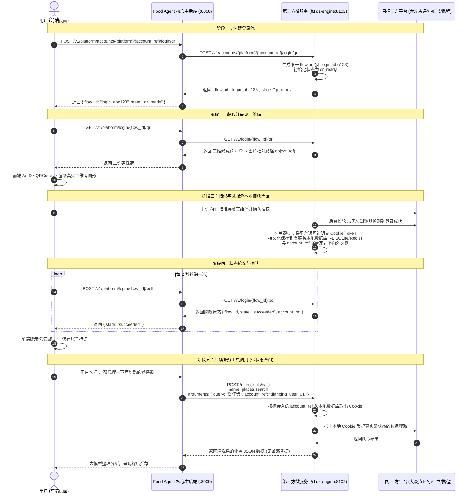

# Food Agent 账号登录态与二维码状态流转规范深度解析

本文档详细解答第三方微服务接入 Food Agent 时关于 **“二维码登录接口规范”**、**“扫码登录全流程状态机”** 以及 **“用户登录态/Cookie 究竟如何流转与隔离”** 的核心机制。

---

## 1. 规范中有提到吗？

**有提到，但此前分布在不同层级的文档中：**
- [`docs/account-services.md`](account-services.md)：定义了上游独立账号微服务的架构边界与 HTTP 契约端点。
- [`docs/mcp-service-integration-guide.md`](mcp-service-integration-guide.md)：列出了第三方服务需暴露的 HTTP 与 MCP JSON-RPC 接口及红线安全拦截清单。
- [`openspec/changes/define-modular-architecture/decisions/ADR-0008-memory-privacy-authority.md`](../openspec/changes/define-modular-architecture/decisions/ADR-0008-memory-privacy-authority.md)：确立了 **零信任凭据隔离（Zero-Trust Credential Isolation）** 权威原则。

本文档将上述分散的技术约定整合成一份端到端的系统性架构指南。

---

## 2. 核心架构哲学：零信任凭据隔离

在 Food Agent 体系中，遵循一条绝对不可动摇的安全红线：

> 🚨 **红线原则**：
> **主后端（Food Agent）永远不接触、不传输、不存储任何目标平台的明文 Cookie、Token、密码、签名密钥（Signer）、浏览器指纹或 StorageState！**
> 主后端的网关装载了强制性的请求/响应审计器（[`validate_remote_payload`](../src/food_agent/contracts/account_service.py)），一旦在数据包中发现包含 `cookie`、`token`、`authorization` 等敏感字眼或类似赋值，**请求将直接被拦截并报 HTTP 422 错误**。

### 既然主后端不要 Cookie，那“登录态”到底保存在哪？
- **Cookie 永远只留在第三方微服务本地**（如微服务自带的 SQLite、Redis 或本地持久化 JSON 文件中）。
- 主后端只认一个由你分配的 **不透明引用（Opaque Reference）**，即 `account_ref`（如 `"dianping_user_01"`）和登录流水号 `flow_id`。

---

## 3. 登录状态全生命周期流转机制

整个二维码扫码登录与后续业务调用的完整流转包含 5 个阶段：

---

## 4. 详细字段与状态机说明

### 4.1 登录状态机枚举 (`state`)
在整个扫码流生命周期中，微服务需要推进并返回以下标准状态之一：

| 状态标识 (`state`) | 含义说明 | 前端 UI 行为 |
| :--- | :--- | :--- |
| `qr_ready` | 二维码已就绪，等待用户扫码 | 展示二维码，启动倒计时 |
| `scanned` | 用户已使用手机 App 扫码，等待在手机端点击“确认登录” | 二维码高亮/遮罩，提示“已扫码，请在手机上确认” |
| `succeeded` | 登录成功，微服务本地已成功存盘 Cookie/会话 | 提示“登录成功”，弹窗自动关闭，账号变更为 ACTIVE |
| `expired` | 二维码已超时失效（通常 2~3 分钟） | 覆盖遮罩，提示“二维码已失效，点击刷新” |
| `failed` | 登录过程中平台风控拦截或网络异常失败 | 提示具体失败原因，允许重试 |
| `cancelled` | 用户或前端主动取消了本次登录 | 停止轮询，释放资源 |

### 4.2 “状态怎么传过去的” —— 核心三问

#### Q1: 二维码到底传的是链接还是图片？
**都可以，系统支持两种形式：**
1. **内容文本/链接形式**（推荐）：
   - 微服务在接口返回 `qr_code_url`（例如携程生成的 `https://accounts.ctrip.com/H5login/...`）或 `qr_code_data`。
   - 前端拿到该字符串后，使用 Ant Design 的 `<QRCode value={url} />` 直接在客户端浏览器 Canvas 上实时绘制图案，清晰度高且传输极快。
2. **图片二进制/相对路径形式**：
   - 微服务生成本地 PNG/JPEG 图片，返回 `object_ref: "/v1/login-flows/{flow_id}/qr"`。
   - 前端或主系统通过 HTTP GET 请求直接读取该图片流渲染在 `` 标签中。

#### Q2: 为什么扫码成功后，主系统不需要 Cookie 就能完成后续数据爬取？
这就是 **基于不透明引用（Opaque Reference）的委派架构**：
- 主系统并不需要知道用户的 Cookie 是什么，**它只需要知道“这个任务由谁去爬”**。
- 主系统在调用 MCP 工具时，会把 `account_ref`（如 `"user_vip_001"`）作为参数传递给微服务。
- 微服务是这个账号的真正管家，它看到 `account_ref: "user_vip_001"` 后，在自己的本地数据库查出对应的 Cookie 注入到网络请求中。
- **好处**：无论外部目标平台更新了 Cookie 格式、加了风控指纹，还是需要刷新 Token，都由微服务内部自行处理，主系统完全不需要改动任何代码！

#### Q3: 现存两套登录提供模式（HTTP vs MCP Tool）有什么区别？
当前生态中存在两种常见的微服务实现：

| 对比维度 | 模式 A：标准 HTTP 账号控制面 (推荐) | 模式 B：纯 MCP Tool 登录模式 |
| :--- | :--- | :--- |
| **典型代表** | 大众点评微服务 (`dz-engine:8102`) | 携程微服务 (`ctrip:8100`) |
| **端点设计** | 遵循标准 REST 规范： `POST /v1/accounts/.../login/qr` `GET /v1/login/{flow_id}/qr` `POST /v1/login/{flow_id}/poll` | 没有 HTTP 端点，全部打包成 MCP 工具： `ctrip_login_start` `ctrip_login_poll` `ctrip_login_status` |
| **优势** | 规范清晰，职责分离；非 AI 的管理控制台可直接标准对接。 | 极简，一个 `/mcp` 端点包揽一切，无需额外起一套 HTTP 路由。 |
| **Food Agent 配置** | 协议选择 `http+mcp` | 协议选择 `mcp`（可通过网关进行 Tool 自动桥接） |

---

## 5. 常见问题排查与总结

1. **为什么我的前端二维码显示的是 `example.com` 假数据？**
   - 前端在请求登录接口失败（如后端报 503）时，默认有一层静默 try-catch 兜底，自动填充了 Mock 字符串 `https://${platform}.example.com/...`。
   - **排查方法**：按 F12 查看 Network 面板中的 `/login/qr` 接口，检查后端真实报错原因（最常见的是服务协议配成了 `mcp` 导致 HTTP 客户端未开启，只需在后台将服务协议改为 `http+mcp` 即可）。
2. **如果微服务重启了，用户的登录态会丢吗？**
   - 取决于微服务自身的持久化实现。推荐微服务使用 SQLite 或 Redis 持久化存储 Session，这样微服务重启后，根据 `account_ref` 依然能恢复用户登录态。
