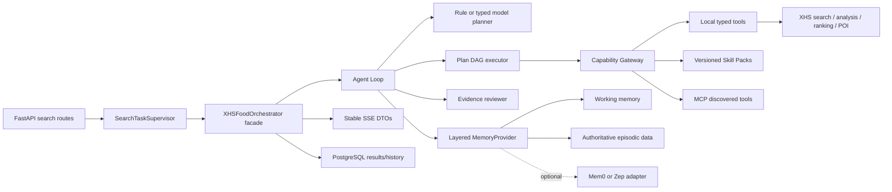

# Code Map

## High-Level Architecture

`POST /v1/search/` reserves a session through `SearchTaskSupervisor`, initializes task state and a fresh per-turn event stream, then starts `run_stream_search`. The public `XHSFoodOrchestrator` is a compatibility facade over a provider-neutral Agent Loop. The loop observes memory, creates a typed Plan DAG, executes ready capabilities concurrently, reviews evidence, and either completes or performs a bounded replan.

## Main Flow

1. `src/api/search/routes.py`: reserve a session and initialize new/refine/recover state.
2. `src/api/search/tasks.py`: supervised background execution, terminal-state handling, and persistence.
3. `src/xhs_food/orchestrator/core.py`: compatibility facade and stable stream/response contract.
4. `src/xhs_food/agentic/search.py`: assemble planner, reviewer, memory, Skill, and search capabilities.
5. `src/xhs_food/runtime/agent_loop.py`: observe -> plan -> execute -> review -> replan/complete.
6. `src/xhs_food/runtime/executor.py`: dependency resolution, bounded concurrency, retry, timeout, cancellation, and idempotency.
7. `src/xhs_food/capabilities/gateway.py`: schema/trust/auth/side-effect policy before every tool call.
8. Existing deterministic search, comment analysis, scoring, POI enrichment, SSE, and PostgreSQL adapters execute behind those ports.

## Agentic Modules

| Path | Responsibility | Coupling rule |
|---|---|---|
| `src/xhs_food/runtime/` | Generic loop, Plan models, planner/reviewer protocols, Agents SDK adapter | Does not import API, storage, spider, or SSE modules |
| `src/xhs_food/capabilities/` | Catalog, policy gateway, Local/Skill/MCP adapters | All model-selected effects pass through this boundary |
| `src/xhs_food/skills/` | Versioned fixed workflow definitions | Deterministic orchestration remains testable without an LLM |
| `src/xhs_food/memory/` | Working/episodic/semantic/procedural routing | Third-party SDKs are optional, never authoritative |
| `src/xhs_food/agentic/search.py` | Food-domain composition root and typed handlers | Domain dependencies are assembled here, not in generic runtime |

## Storage

- RedisMemory/in-memory providers hold short-lived working context.
- PostgresStorage stores authoritative chat messages, evidence/results, and optional embeddings.
- `LazySessionManagerMemoryProvider(read_only=True)` lets the loop recall durable context without duplicating API-owned message writes.
- `ThirdPartyMemoryAdapter` can add Mem0/Zep-style semantic retrieval; PostgreSQL remains the system of record.
- UserStorageService stores users, favorites, history, restaurants, and search results.
- Search results are uniquely versioned by `(session_id, turn_id)`; idempotent schema initialization adds the required columns/index.

## Extension Points

- Register a `LocalCapability`, versioned `SkillDefinition`, or mount an MCP client through `MCPToolSource.load_into()`.
- Implement another `Planner`, `Reviewer`, `AgentRuntime`, or `MemoryProvider` without changing API routes.
- Enable the typed OpenAI planner with `AGENT_MODEL_PLANNER_ENABLED=true`; the deterministic planner remains the default fallback.
- Add a different event bus backend implementing the EventBus protocol.
- Keep API DTO conversion in a dedicated boundary module before changing frontend components.

## Risky Areas

- `src/xhs_food/auth/` handles persistent cookies and external login/signature state.
- `src/api/search/tasks.py` owns background task completion/error semantics and persistence.
- `src/xhs_food/events/bus.py` owns replay/heartbeat/terminal behavior.
- `src/xhs_food/runtime/executor.py` owns retry, concurrency, cancellation, and stable turn-level idempotency semantics.
- `src/xhs_food/capabilities/gateway.py` is the mandatory policy boundary; domain code must not bypass it for model-selected calls.
- `src/xhs_food/services/user_storage/schema.py` must stay synchronized with migrations and repositories.
