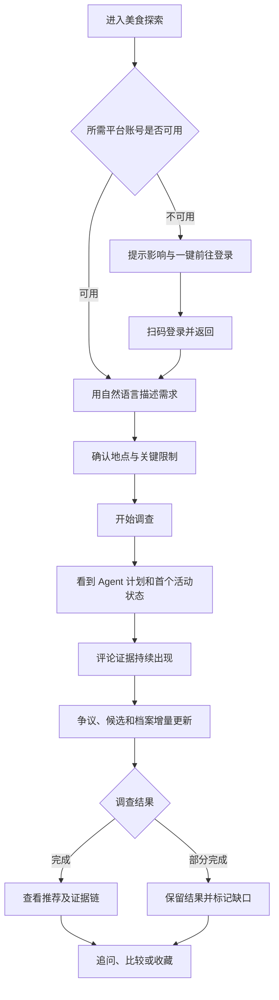

# Food Agent 前端 UI/UX 产品需求文档

> 文档版本：v1.0 Draft
> 文档状态：设计输入稿，待产品与设计评审
> 主要读者：产品设计师、交互设计师、视觉设计师、内容设计师
> 设计范围：用户端、研究会话、平台账号接入、内部观测与配置端
> 不包含：前端框架选型、组件库选型、接口实现、工程排期

## 1. 文档目的

本文档用于指导 Food Agent 的完整前端体验设计。设计师应据此完成信息架构、关键流程、页面布局、交互原型、视觉系统和状态设计，而不是照搬当前页面。

当前代码中的 Vue 页面、React island、旧 TSX 原型、既有颜色与布局均只能作为业务线索，不能作为新版 UI 的视觉基准。本次设计应从产品任务出发，解决以下核心问题：

1. 用户如何用自然语言发起一次真正的美食调查，而不是普通关键词搜索。
2. Agent 如何在较长的调查过程中持续给用户有效反馈，而不是只显示加载动画。
3. 如何把评论证据、评论中的争议和反例放在体验中心，而不是把平台评分或宣传图片放在中心。
4. 如何让推荐结论可追溯、可质疑、可继续追问。
5. 如何在大众点评补充资料失败、账号失效或网络中断时保留已经取得的研究价值。
6. 如何让普通用户界面和内部运营观测界面各自清晰，不互相泄漏复杂度。

本文档描述目标体验。附录会标明当前后端能力边界，避免设计评审时误以为所有目标都已经具备接口支持。

## 2. 产品定义

### 2.1 一句话定义

Food Agent 是一个以真实评论证据和争议分析为核心的美食深度调查助手：它从小红书笔记评论中发现店铺与菜品线索，识别相互矛盾的体验，再用大众点评补充店铺地址、图片、营业信息、菜品和其他结构化档案，最终给出可复核的推荐结论。

### 2.2 它不是什么

Food Agent 不是：

- 按热度排列的餐厅榜单；
- 只把平台评分重新包装一遍的聚合页；
- 输入一句话后等待最终答案的黑盒聊天机器人；
- 展示 Agent 内部思维链、原始工具参数和运行日志的开发者控制台；
- 用“大量好评”代替证据质量判断的种草产品。

### 2.3 核心产品假设

真正影响到店决策的信息经常出现在评论的纠正、争论和细节中，例如：

- “这家锅底香，但越煮越咸”；
- “本地人说老店和网红分店不是同一家”；
- “招牌菜好吃，但周末排队两小时”；
- “价格不低，不过分量适合三个人”；
- “笔记都在推荐 A，评论区反而都在说 B 才值得点”。

因此，体验优先级必须是：

```text
评论证据与争议
    ↓
Agent 对证据的综合判断
    ↓
候选与推荐
    ↓
大众点评补充的店铺事实
    ↓
平台热度、评分等辅助指标
```

大众点评不是主要结论来源。其主要职责是补充候选线索和持久化店铺档案，不得在视觉层级上把评分、评论数或推广图片变成推荐依据的替代品。

### 2.4 Agent 工作方式对体验的影响

系统采用单一自主调查 Agent。Agent 会结合用户意图、会话上下文、已有证据、未解决争议和剩余预算，自主制定计划、调用被允许的工具、检查结果、补充调查并决定何时结束。

前端需要呈现“Agent 正在做什么、发现了什么、还缺什么”，但不呈现模型私密推理过程。用户看到的应是经过整理的计划和事实，不是 chain-of-thought。

## 3. 用户与使用情境

### 3.1 主要用户：谨慎的到店决策者

典型需求：

- 到陌生城市旅游，希望避开营销店；
- 在本地寻找有特色、但不一定热门的店；
- 对价格、排队、辣度、卫生、停车、老人儿童友好度等有明确限制；
- 不愿意自己翻几十篇笔记和几百条评论；
- 愿意阅读少量关键原始评论，以判断 Agent 是否可信。

核心问题不是“有什么店”，而是“为什么这家适合我、可能在哪些方面踩雷”。

### 3.2 深度研究型用户

这类用户希望：

- 查看更多评论证据；
- 理解争议双方分别依据什么；
- 针对某个候选继续追问；
- 改变预算、距离、口味等条件后继续同一会话；
- 比较两到四家候选，而不是接受单一答案；
- 知道哪些结论已经核实，哪些只是当前推断。

### 3.3 回访用户

这类用户希望：

- 恢复之前的调查；
- 找到收藏的店铺；
- 看清档案和证据的新鲜程度；
- 用已有偏好快速发起下一次调查；
- 纠正系统记住的偏好。

### 3.4 内部运营与维护人员

运营人员需要判断：

- 小红书、大众点评账号是否可用；
- MCP 工具和能力映射是否就绪；
- 任务为什么缓慢、失败或部分完成；
- 哪一类证据或档案经常缺失；
- 模型、工具和数据源策略是否按管理规则放行；
- 是否需要重新登录、重试任务或调整配置。

运营端不面向普通用户，信息密度可以更高，但仍不得暴露密钥、Cookie、原始认证信息或模型私密推理。

## 4. 用户体验目标

### 4.1 核心目标

1. **快速开始**：用户无需理解 Agent、MCP 或平台采集机制，即可描述需求并开始调查。
2. **尽早获得价值**：第一条有意义的评论证据出现后立即展示，不强迫用户等到完整调查结束。
3. **过程可理解**：用户始终知道当前阶段、已经找到多少有效证据、是否仍在调查以及哪些部分失败。
4. **结论可核验**：每个重要推荐、优点、风险和争议都能跳转到其依据。
5. **部分失败仍可用**：可选补充来源失败时，已取得的评论证据和候选不会消失。
6. **追问自然连续**：多轮对话由 Agent 基于完整上下文处理，不设计“是否属于追问”的人工分支。
7. **移动端可决策**：手机上仍能顺畅完成搜索、查看评论、比较争议、追问和收藏。
8. **操作可恢复**：刷新、短暂断网、事件重放过期和重新打开历史会话时，不重复创建调查，也不丢失已呈现结果。

### 4.2 建议衡量指标

设计方案需要支持后续衡量以下指标：

- 发起调查成功率；
- 从进入页面到提交调查的时间；
- 从提交到首条有效证据可见的时间；
- 调查过程中用户离开率；
- 推荐到证据的查看转化率；
- 争议详情查看率；
- 首轮完成后的追问率；
- 部分完成状态下继续使用或恢复的比例；
- 收藏、恢复历史会话和再次访问店铺档案的比例；
- 平台账号失效后的修复成功率。

这些指标用于判断体验是否清晰，不作为界面上必须显示的统计数字。

## 5. 设计原则

### 5.1 证据优先，而不是卡片优先

评论是主要洞察来源。设计不得把评论折叠到推荐卡最深层，也不得只展示评论数量。关键评论的正文摘录应在调查过程中直接可见，并与店铺、判断和争议形成明确连接。

### 5.2 结论和依据永远相邻

任何“值得去”“不推荐”“排队风险高”“招牌菜是某菜”等判断，都应能在一次操作内查看相关证据。用户不需要记住证据编号再去另一个页面查找。

### 5.3 展示行动摘要，不展示私密推理

可以展示：

- 当前调查目标；
- 调查步骤；
- 正在查询的公开能力类别；
- 已取得的数量和阶段性发现；
- 为什么还需要补充某类证据的简洁说明。

不得展示：

- chain-of-thought；
- planner prompt 或 critic scratchpad；
- 原始 MCP 参数；
- 账号引用、Cookie、令牌和请求头；
- 未清洗的上游返回数据。

### 5.4 不伪造完整性

缺少评分、地址、图片、价格或证据时，应明确显示“暂无数据”“正在补充”或“补充失败”，不能使用看似真实的默认值。未知和零必须有不同表达。

### 5.5 部分完成不是失败页

只要已有可用评论证据，补充来源失败就应表现为“可使用，但有明确缺口”。页面继续显示已有结果，把影响范围和恢复操作放在相关位置。

### 5.6 增量更新应稳定，不应打断阅读

新证据、档案字段和排序会陆续到达。更新需要可感知但不过度跳动：

- 不把用户正在阅读的内容突然移走；
- 排序变化需要说明和轻量过渡；
- 用户展开的详情不得因为数据更新自动关闭；
- 新内容到达但用户已向下阅读时，提供“有新发现”提示，不强制滚动。

### 5.7 对话和研究工作台各司其职

对话用于表达需求、解释阶段性结论和继续追问；研究工作台用于承载证据、争议、店铺档案和推荐关系。两者共享同一调查状态，但不重复渲染同一批内容。

### 5.8 普通用户不承担系统复杂度

普通用户不需要理解 `xhs_pc`、`account_ref`、`taskId`、SSE、MCP 或重放游标。只有在诊断详情或运营端才显示技术标识。

## 6. 产品术语与内容规范

| 产品术语 | 面向用户的含义 | 不推荐表达 |
|---|---|---|
| 调查 / 研究 | Agent 正在持续搜集和判断，而非一次检索 | 抓取、爬虫任务 |
| 评论证据 | 支撑或反驳某个判断的具体评论摘录 | 数据条目、payload |
| 争议 | 针对同一店铺或体验存在的相互矛盾说法 | 模型冲突 |
| 店铺档案 | 地址、图片、菜品、营业信息等辅助事实 | POI JSON |
| 推荐 | 当前证据下适合用户条件的候选 | 绝对最好、权威排名 |
| 数据缺口 | 尚未获得或获取失败、会影响结论的信息 | Exception、provider error |
| 部分完成 | 已有可用成果，但仍存在明确缺口 | 成功但报错 |
| 可信度 | 当前证据支撑程度，不等于真实概率 | 准确率、保证 |
| 继续调查 | 在同一会话中补充条件或核查问题 | refine API |

所有状态文案应回答三件事：发生了什么、已有内容是否保留、用户现在能做什么。

## 7. 信息架构

### 7.1 用户端

```text
用户端
├── 美食探索
│   └── 发起调查
├── 研究会话
│   ├── 对话与追问
│   ├── 调查计划与进度
│   ├── 推荐结论
│   ├── 评论证据
│   ├── 争议与反例
│   ├── 店铺档案
│   └── 数据缺口
├── 我的收藏
├── 调查历史
├── 平台账号
└── 个人偏好与记忆
```

### 7.2 内部运营端

```text
运营端
├── 系统总览
├── 服务与工具
│   └── 服务详情 / 工具映射
├── 平台账号状态
├── 任务观测
├── 证据观测
└── 模型与调查策略治理（目标能力）
```

### 7.3 导航原则

- 用户端与运营端必须有明显不同的视觉身份和入口，避免普通用户误入技术控制台。
- 桌面用户端允许使用稳定侧栏；进入研究会话后可自动收窄或折叠侧栏，为证据阅读留出空间。
- 移动端一级导航最多保留四个高频入口：探索、历史、收藏、我的。平台账号放入“我的”或上下文修复入口。
- 研究会话的返回操作应回到来源页，同时保留会话状态；不能因返回再进入而启动重复任务。
- 运营端使用高密度顶部或侧边导航，始终显示当前环境和整体就绪状态。

## 8. 核心用户旅程

### 8.1 首次使用并完成一次调查



### 8.2 多轮追问

1. 用户在原会话输入新的自然语言要求，例如“只看步行 20 分钟内的”“第二家排队到底有多严重”。
2. 界面把追问作为新的用户消息加入同一会话，并明确进入下一轮调查。
3. 既有证据、争议和档案保持可访问；新一轮状态不能把上一轮结果清空。
4. Agent 根据完整会话上下文自主决定复用证据、补充搜索还是重新核实。
5. 新旧结论发生变化时，界面说明“哪些条件改变导致推荐调整”。
6. 用户可在轮次之间查看当时的结论，但默认看到最新轮次。

不设置“这是追问还是新搜索”的人工识别步骤，也不使用独立 FollowUpHandler 概念暴露给用户。

### 8.3 断网与恢复

1. 网络断开时保持当前内容，顶部显示“连接中断，已保留当前结果”。
2. 自动重连期间不重复创建调查。
3. 重连成功后只加入缺失事件，不重复插入证据。
4. 若事件窗口已过期，进入“正在同步最新快照”，内容可继续阅读但暂时不接受依赖最新状态的操作。
5. 快照同步完成后恢复实时状态，并用轻量提示说明已同步。

### 8.4 部分来源失败

示例：小红书评论已产生有效线索，但大众点评详情要求交互验证。

界面必须：

- 保留所有评论证据、争议和候选；
- 把相关店铺档案标记为“资料部分补齐”；
- 在对应档案和统一缺口区域同时提供上下文提示；
- 明确告诉用户缺少的是地址、图片、价格或其他哪些字段；
- 提供“重新登录账号”“重试补充”或“稍后继续”操作；
- 最终状态使用“部分完成”，不能显示为全局失败或空结果。

## 9. 全局框架需求

### 9.1 用户端框架

用户端整体气质应安静、可信、适合阅读和反复决策，不做营销落地页式大 Hero。首屏应直接出现可用的调查入口，并露出最近研究或示例需求。

全局框架包含：

- 产品标识；
- 一级导航；
- 当前用户或设备身份入口；
- 平台账号异常提醒；
- 全局网络状态；
- 页面内容区；
- 移动端底部导航。

### 9.2 运营端框架

运营端强调扫描、比较和重复操作：

- 始终标明当前环境；
- 全局就绪度固定可见；
- 高影响问题优先于健康指标；
- 技术 ID 支持复制，但默认使用人类可读名称；
- 列表筛选状态可以保留；
- 危险操作需要确认和影响范围说明。

### 9.3 全局反馈

- 页面级错误：内容不可用且无法继续时使用。
- 区域级错误：仅某个模块失败时使用，不遮挡其他模块。
- Toast：只用于操作结果，不用于承载长期重要状态。
- 状态变化：由文本、图标和颜色共同表达，不能只依赖颜色。
- 后台持续调查：离开会话后应在导航或历史中保留运行状态，完成后提供非打扰式通知。

## 10. 美食探索页

### 10.1 页面目标

让用户以最低认知成本表达“想吃什么、在哪里、有哪些硬限制”，并理解系统将进行一次需要时间的证据调查。

### 10.2 首屏信息层级

1. 产品名和一句简短定位。
2. 大尺寸自然语言输入框。
3. 主操作“开始调查”。
4. 关键条件快捷项。
5. 数据源/账号可用性提示。
6. 最近调查或场景示例。

不需要大面积品牌宣传、功能介绍卡片或装饰性插图。

### 10.3 自然语言输入

输入框需要支持：

- 多行需求；
- 中文输入法组合态，不误触提交；
- Enter 提交、Shift+Enter 换行；
- 移动端明确发送按钮；
- 粘贴较长条件；
- 字数上限及超限提示；
- 提交中的防重复操作；
- 从示例需求一键填入但不立即发送。

占位文案应展示真实决策条件，例如：

> 成都春熙路附近，本地人常去的老火锅，三个人，人均 120 以内，不要特别甜的锅底，周六晚上排队别超过一小时。

### 10.4 条件输入

自然语言是主入口，结构化条件是辅助确认，不应让用户先填写复杂表单。建议支持：

- 城市、商圈或当前位置；
- 距离或通勤范围；
- 人均预算；
- 菜系或具体食物；
- 辣度和口味；
- 用餐场景：一人食、约会、家庭、聚餐、商务、夜宵；
- 时间与排队容忍度；
- 忌口、过敏、老人儿童、无障碍等硬限制；
- 明确排除项。

已识别条件用可编辑标签展示。用户删除标签不应改写原始输入，而是在提交前形成明确的最终条件摘要。

### 10.5 调查策略

普通用户不直接看到“缓存策略”等工程术语。可提供三种可理解模式：

- **快速参考**：优先复用仍然新鲜的既有证据；
- **补充调查**：复用既有证据，并针对缺口获取新信息；
- **重新调查**：尽量重新获取主要证据。

默认使用“快速参考”。每个选项需说明预期耗时和适用场景，但不得承诺固定完成时间。

### 10.6 数据源与账号提示

- 默认由系统根据调查目标选择数据源，不要求普通用户手动编排平台。
- 高级设置可以让用户限制“只使用已连接来源”，但必须解释这会影响证据完整性。
- 小红书账号不可用时，应在提交前说明“核心评论证据可能无法取得”。
- 大众点评账号不可用时，应说明“仍可调查评论，但地址、图片等店铺资料可能不完整”。
- 提供上下文登录入口，登录成功后回到保留原输入的探索页。

### 10.7 模型选择

模型不是普通用户的首要决策。若产品开放模型选择，应放在“高级研究设置”中：

- 只显示管理端允许使用的模型；
- 使用“快速 / 均衡 / 深度”等能力描述，而不是只显示内部模型 ID；
- 可以显示预计速度、是否支持深度推理、上下文能力等已知属性；
- 用户只选择推理强度，不直接调整 temperature 等底层参数；
- 管理端可设默认值和硬限制，用户端不得绕过。

当前后端尚无公开模型治理 API，因此该部分属于目标设计能力，需单独标注。

### 10.8 页面状态

设计必须覆盖：

- 默认；
- 输入聚焦；
- 条件解析中；
- 条件存在冲突；
- 核心账号未连接；
- 可选账号未连接；
- 提交中；
- 提交失败；
- 最近调查为空；
- 有正在运行的历史调查。

## 11. 研究会话工作台

### 11.1 页面定位

这是产品的核心页面，应同时满足三种任务：

1. 理解 Agent 当前正在调查什么；
2. 阅读已经形成的证据和结论；
3. 随时补充条件、质疑结论或要求继续调查。

它不是传统聊天记录页，也不是静态报告页，而是一个随事件持续更新的调查工作台。

### 11.2 桌面布局要求

设计应使用工作台式布局，并满足以下责任分区：

- **会话与计划区**：显示用户轮次、Agent 简洁回应、当前阶段和调查计划；
- **研究主体区**：显示推荐、争议、评论证据和店铺档案；
- **上下文详情区**：显示当前选中店铺、争议或证据的关联链路。

不强制设计师使用固定三栏，但必须做到：

- 研究主体拥有最大阅读宽度；
- 评论证据不是边缘侧栏里的附属信息；
- 计划默认占用较小空间且可折叠；
- 详情区可按选择出现，不要求始终占位；
- 全局导航在研究页面可以收起，以避免四重栏结构；
- 追问输入在长页面中始终容易抵达。

### 11.3 移动端布局要求

- 顶部显示返回、会话标题和总状态；
- 使用紧凑分段导航切换“结论、证据、争议、档案、进度”；
- 关键状态和新发现数量固定在可扫描区域；
- 详情通过全屏页或底部抽屉打开；
- 追问输入固定在安全区上方，可折叠为单行入口；
- 打开键盘后不能遮住发送按钮和用户最后一条消息；
- 新事件不得把用户从当前阅读位置拉回顶部。

### 11.4 会话头部

必须显示：

- 由用户需求生成的可读标题；
- 当前轮次；
- 调查状态；
- 最近更新时间；
- 连接状态的异常提示；
- 返回与更多操作。

更多操作包括：

- 停止当前调查；
- 恢复调查；
- 重新连接；
- 分享或导出报告（目标能力）；
- 删除会话；
- 查看诊断信息，仅运营或高级入口可见。

普通状态下不显示完整 `sessionId`、`taskId` 或 `runId`。

### 11.5 对话区

对话区只承担以下内容：

- 用户原始需求与后续追问；
- Agent 对需求的确认或必要澄清；
- 阶段性重要发现；
- 计划发生显著变化的简洁说明；
- 最终综合回答；
- 与部分失败相关、需要用户操作的说明。

不得为每次工具调用产生一条聊天消息。连续的工具活动应汇总为可折叠的“调查活动”，例如“正在核对 4 家候选店的评论”。

Agent 消息中的结构化内容可以引用研究主体模块，但不重复渲染整组评论和档案。

### 11.6 追问输入

追问支持：

- 针对整个调查提问；
- 从某家店、某条评论或某个争议发起带上下文追问；
- 在输入区清楚显示当前附带的上下文对象，并允许移除；
- 调查运行时继续输入；是否立即发送由系统能力决定，但状态需明确；
- 停止生成/停止调查；
- 失败后保留未发送文本；
- 快捷建议来自未解决争议和数据缺口，例如“继续核实周末排队”“只比较前两家”。

追问提交后，界面进入新轮次，但上一轮研究结果保持可查看。

## 12. 增量事件的界面行为

前端目标体验以 `ResearchEvent v1` 和 `UserResearchProjection v1` 为信息基础。设计师不需要理解传输协议，但必须覆盖每种业务事件对应的用户反馈。

| 事件 | 对用户的意义 | 必需界面行为 | 不应发生 |
|---|---|---|---|
| `run_started` | 调查已经接受并开始 | 添加 Agent 确认、显示目标与运行状态 | 只显示无限加载动画 |
| `plan_updated` | Agent 调整了调查步骤 | 原位更新计划，显著变更给出简短说明 | 每次更新新增一张重复卡片 |
| `action_started` | 开始一项调查动作 | 更新当前活动摘要 | 暴露原始工具参数 |
| `action_progress` | 动作已有进展 | 更新数量或阶段文字 | 高频闪烁、抢焦点 |
| `action_completed` | 一项动作结束 | 标记步骤状态，并突出它带来的新发现 | 把“调用成功”等同于“已有结论” |
| `evidence_added` | 新评论证据可用 | 立即加入证据区，更新计数和相关实体 | 等所有评论完成后才显示 |
| `controversy_upserted` | 发现或更新争议 | 原位新增/更新争议，关联双方证据 | 删除旧证据或只保留最终观点 |
| `profile_upserted` | 店铺资料得到补充 | 同一档案渐进补齐字段 | 后续空值覆盖已有字段 |
| `recommendation_upserted` | 候选状态或排序变化 | 更新状态、排序和解释；保留用户阅读位置 | 无说明地让店铺消失 |
| `gap_upserted` | 出现或解决数据缺口 | 在相关模块和缺口中心同步显示 | 把可选来源问题升级成全局失败 |
| `run_progress` | 阶段总结、覆盖度变化 | 更新摘要、进度和统计 | 将内部日志原样输出 |
| `run_completed` | 完成或部分完成 | 显示最终结论、完成状态和后续操作 | 部分完成显示成完全成功 |
| `run_failed` | 无法形成可用调查成果 | 保留过程信息，解释失败并提供恢复入口 | 显示空白页或丢掉已有诊断 |
| `run_cancelled` | 用户或系统停止调查 | 保留已取得内容，说明是否可恢复 | 把停止等同于删除 |
| `x.*.*` | 未来扩展事件 | 未知客户端可安全忽略并继续同步 | 因未知事件崩溃或阻断页面 |

### 12.1 新内容提示

- 用户在页面顶部或当前模块时，新内容可以轻量高亮后融入列表。
- 用户正在阅读较早内容时，显示“3 条新证据”浮动入口；点击后再定位。
- 新推荐导致排序变化时，先保留可视位置，并标记“因新证据上升/下降”。
- 同一对象更新使用原位过渡，不重复创建对象。

## 13. 调查计划与进度

### 13.1 信息内容

计划至少包含：

- 用户可理解的步骤名称；
- 当前阶段；
- 步骤状态；
- 简洁详情；
- 已完成数量；
- 开始与完成时间，在需要时显示；
- 与步骤相关的证据、候选或缺口数量。

### 13.2 状态

步骤状态包括：待执行、执行中、已完成、部分完成、失败、已跳过。

- “部分完成”需说明缺少什么；
- “失败”需说明是否影响最终结论；
- “已跳过”需说明是条件不适用、证据已足够还是策略决定；
- 计划变化时保留已完成步骤，不让用户误以为进度回退。

### 13.3 展示边界

计划默认展示语义阶段，不展示工具名和内部函数名。运营诊断端可以显示标准化能力名称，但仍不展示 secret-shaped 参数。

## 14. 评论证据体验

### 14.1 核心要求

评论证据是本产品最重要的内容，不采用“只有 Top-K 候选才加载或展示详细评论”的设计。只要评论已被清洗并进入公开证据合同，就应支持用户阅读其完整的有界摘录。

### 14.2 单条证据内容

必须支持以下字段，其中不存在的字段不占空位：

- 评论摘录；
- 来源平台；
- 来源笔记标题；
- 笔记引用与评论引用；
- 抓取或发布时间；
- 立场：正向、负向、中性、混合；
- 关联店铺、菜品或判断；
- 可信度，仅在真实提供时显示；
- 是否属于某个争议；
- 来源链接，仅在安全且可访问时提供。

### 14.3 证据浏览

支持：

- 按店铺筛选；
- 按立场筛选；
- 按来源筛选；
- 按争议主题筛选；
- 文本搜索；
- 新到达优先或按相关性排序；
- 从证据跳到关联争议、推荐和档案；
- 从推荐反向定位所有支撑与反例证据。

默认不能只展示正向证据。正向与负向评论需要公平可见，避免形成推荐确认偏差。

### 14.4 摘录与原文

- 默认显示足以理解观点的摘录，不用模糊省略导致语义改变；
- 超长摘录允许展开；
- 展开不能把用户带离当前调查；
- 无法提供原文链接时明确标记“公开摘录”，不伪装成可点击链接；
- 不公开评论者个人敏感信息；
- 相同评论被多个判断引用时只保留一个证据实体，通过关联关系复用。

## 15. 争议与反例体验

### 15.1 争议不是负面警告

争议代表体验因时间、人群、分店、菜品或预期不同而不一致。它不是简单红色风险，也不代表 Agent 判断失败。

### 15.2 单个争议模块

需要显示：

- 争议主题；
- 简短背景；
- 当前状态：仍有分歧、部分核清、已核清；
- 至少两侧观点；
- 每侧摘要和支持证据数；
- 关键评论摘录；
- 当前判断；
- 仍待回答的问题；
- 置信度，仅有数据时显示；
- 最近更新时间。

### 15.3 交互

- 点击争议侧可筛选并显示该侧证据；
- 点击证据可回到原评论上下文；
- 用户可从争议直接发起“继续核实”；
- 争议由未解决变为已核清时保留双方历史证据；
- 若争议只适用于高峰时段或特定分店，应在主题中明确范围；
- 推荐卡必须能显示其关联争议数和最高影响争议。

## 16. 推荐体验

### 16.1 推荐状态

推荐对象存在四种状态：

- **候选**：刚从评论线索识别，证据仍不足；
- **部分可推荐**：已有重要证据，但档案或争议尚未补齐；
- **推荐**：当前证据满足调查条件；
- **已过滤**：因硬限制或强反例未进入结果。

默认结果区展示候选、部分可推荐和推荐。已过滤项放在可展开的“为什么没有入选”中，帮助用户理解而不干扰主要决策。

### 16.2 推荐条目内容

- 当前排名及变动原因；
- 店铺名称；
- 一句话结论；
- 推荐状态；
- 与用户条件的匹配点；
- 主要风险或不适用人群；
- 评论证据数量；
- 争议数量；
- 资料完整度；
- 可信度，仅有真实值时显示；
- 关联店铺档案入口；
- 收藏、比较、针对该店追问。

推荐卡不得用大图、星级和平台评论数压过证据摘要。

### 16.3 推荐详情

详情应把信息组织为：

1. 为什么适合当前用户；
2. 最有说服力的证据；
3. 最重要的反例或争议；
4. 必点与慎点；
5. 地址、营业时间等到店信息；
6. 尚未核实的信息；
7. 继续追问和收藏。

### 16.4 比较

允许选择两到四家进行比较。比较维度优先来自用户条件和证据：

- 口味匹配；
- 排队与到店成本；
- 预算；
- 适合场景；
- 评论一致性；
- 主要争议；
- 档案完整度。

缺失数据使用“未知”，不得把未知当成较差分数。

## 17. 店铺档案体验

### 17.1 定位

店铺档案是相对稳定的持久化事实，用于完成到店决策。它与每次调查产生的评论证据分开维护，因此页面需要标明资料来源和更新时间。

### 17.2 可展示字段

根据实际存在的数据渐进展示：

- 店铺名称和别名；
- 门店或平台引用；
- 封面与图片集；
- 地址、城市、行政区、商圈；
- 经纬度和地图入口；
- 电话；
- 营业时间；
- 分类与标签；
- 平台评分和评价数；
- 人均价格或价格带；
- 推荐菜、菜品图片和相关说明；
- 优惠或促销；
- 其他扩展属性；
- 来源；
- 最近更新时间；
- 档案状态和资料完整度；
- 与当前档案有关的数据缺口。

### 17.3 渐进补齐

- 档案创建后可以先显示名称和地址，再补图片、菜品等；
- 已知字段不能因后续失败变空；
- 新字段到达时在对应位置轻量提示；
- “档案完整”只表示合同要求的字段已满足，不代表信息永远正确；
- 评分、价格和营业时间必须显示来源和新鲜程度；
- 图片失败时使用稳定占位，不用与实际店铺无关的图库照片。

## 18. 数据缺口与部分失败

### 18.1 缺口信息结构

用户可见缺口需要表达：

- 哪个来源或阶段出现问题；
- 缺少什么；
- 影响哪些店铺或结论；
- 影响程度：提示、需关注、高影响；
- 当前状态：待处理、重试中、已补齐、已耗尽；
- 是否可以重试；
- 用户是否需要重新登录；
- 已有研究结果是否仍然有效。

不显示原始异常栈或无法理解的错误码。运营端可以附带稳定错误码用于检索。

### 18.2 全局运行状态

| 状态 | 用户理解 | 视觉语气 | 主要操作 |
|---|---|---|---|
| 排队中 | 调查已接受，等待开始 | 中性、稳定 | 取消 |
| 调查中 | 仍在获取或分析信息 | 活跃但不焦虑 | 追问、停止 |
| 已完成 | 核心目标已满足 | 明确完成 | 查看结论、追问、收藏 |
| 部分完成 | 有可用成果，但存在缺口 | 提醒而非失败 | 查看影响、继续补充 |
| 等待补充 | 需要用户条件或认证 | 明确下一步 | 补充条件、登录 |
| 失败 | 无法形成可用成果 | 清晰、克制 | 重试、修改条件 |
| 已取消 | 调查停止，内容保留 | 中性 | 恢复或新建 |

### 18.3 重试规则的界面要求

- 重试操作必须说明范围，例如“重试大众点评店铺资料”，不使用笼统“重试全部”；
- 重试中禁用重复点击；
- 重试失败保留原缺口和原研究内容；
- 已解决缺口保留在历史中，但默认折叠；
- 需要登录时优先引导登录，不进行注定失败的重复调用。

## 19. 连接、同步与恢复状态

前端需区分业务运行状态和网络连接状态。

| 连接状态 | 表现要求 |
|---|---|
| 正在连接 | 紧凑提示，不遮挡已有内容 |
| 实时更新中 | 默认低存在感，可通过状态点查看 |
| 正在重连 | 保留内容，说明会自动恢复 |
| 已断开 | 提供手动重连，明确当前内容是最后同步版本 |
| 正在同步快照 | 保留可读内容，暂缓依赖最新状态的操作 |
| 已同步 | 轻量确认后自动消退 |
| 无法恢复 | 提供返回历史、重新发起或诊断入口 |

事件重复不得造成重复评论；事件缺序不得由界面自行猜测。同步快照不得创建新任务。

## 20. 收藏页

### 20.1 页面目标

帮助用户重新找到已认可的店铺，并理解收藏时的研究上下文是否仍然新鲜。

### 20.2 列表内容

- 店铺名称和主要图片；
- 收藏时间；
- 收藏来源会话；
- 收藏时的一句话结论；
- 关键优点和风险；
- 地址、人均等当前档案；
- 最近档案更新时间；
- 是否存在未解决争议；
- 是否需要重新调查。

### 20.3 操作

- 打开店铺详情；
- 返回原研究会话；
- 重新调查；
- 加入比较；
- 取消收藏，需要可撤销反馈；
- 按城市、菜系、收藏时间筛选；
- 搜索店名或标签。

空状态应直接提供“开始一次美食调查”，而不是只显示空图形。

## 21. 调查历史页

### 21.1 列表内容

- 用户原始问题；
- 主要地点和条件；
- 创建与最后更新时间；
- 当前轮数；
- 运行状态；
- 推荐、证据和缺口数量；
- 是否可恢复；
- 最终摘要的一行预览。

### 21.2 操作

- 继续会话；
- 恢复中断调查；
- 基于原条件重新调查；
- 删除单条；
- 批量清理，需二次确认；
- 按状态、时间、城市筛选；
- 搜索历史问题。

正在运行的调查应持续更新状态。删除历史不能用模糊文案暗示同时删除平台原始数据，实际影响范围必须明确。

## 22. 平台账号页与登录流程

### 22.1 页面目标

让用户理解哪些数据源已经连接、失效会影响什么，并能完成扫码登录、重新认证和取消流程。

### 22.2 账号卡片

每个平台显示：

- 平台名；
- 账号别名；
- 连接状态；
- 支持能力的用户语言摘要；
- 最近检查时间；
- 失效对研究的影响；
- 登录、重新认证、查看详情和移除操作。

技术 `account_ref` 可在详情里复制，但不是主标题。

### 22.3 二维码登录

流程状态：创建中、等待二维码、待扫码、确认中、成功、已过期、失败、已取消。

交互要求：

- 二维码区域尺寸稳定，不因状态文字变化跳动；
- 显示倒计时和刷新入口；
- 清楚标识需要使用哪个 App 扫码；
- 扫码后自动轮询并反馈“已扫码，等待确认”；
- 登录成功自动关闭或提供明确完成按钮，并返回原任务；
- 过期后可生成新流程，不复用旧二维码；
- 关闭弹窗时询问是否取消仍在运行的登录流程；
- 后端只返回展示引用而非直接图片 URL 时，设计仍视其为“安全二维码呈现区”，不向用户暴露引用值。

### 22.4 认证安全

- 不在主应用中要求输入平台密码；
- 不显示 Cookie、token 或 secret；
- 敏感凭据保存成功后不允许再次完整查看；
- 移除账号前说明它会影响哪些正在运行或可恢复的调查。

## 23. 个人偏好与记忆

### 23.1 资料与默认偏好

支持设计：

- 昵称和常用城市；
- 常用预算；
- 口味与辣度；
- 忌口和过敏；
- 常见用餐场景；
- 排队、距离和环境偏好；
- 通知设置。

### 23.2 记忆透明度

用户需要知道 Agent 记住了什么，并可以：

- 查看明确保存的偏好；
- 修改或删除偏好；
- 区分用户明确设置和系统低置信度推断；
- 关闭个性化记忆；
- 清理历史记忆；
- 在单次调查中临时覆盖偏好，而不永久修改。

不得把原始聊天记录和“已提炼偏好”混为同一概念。

## 24. 运营端需求

### 24.1 总体原则

运营端服务于排障和治理，不是用户端的另一套视觉皮肤。设计应高密度、可筛选、支持复制诊断信息，同时保持敏感数据默认不可见。

### 24.2 系统总览

首屏按以下优先级组织：

1. 当前高影响异常；
2. 小红书与大众点评服务就绪度；
3. 运行中、排队、部分完成、失败任务；
4. 最近错误类别和恢复状态；
5. 证据产出、档案补充和缺口趋势；
6. 基础资源与延迟指标。

指标缺失时显示“无数据”，不生成演示数字。当前部分运营页面使用前端模拟数据，目标设计需标注真实数据需求。

### 24.3 服务与工具目录

服务列表展示：

- 服务名称和平台；
- HTTP/MCP 通道状态；
- 最近刷新时间；
- 已发现工具数；
- 放行工具数；
- 账号数量和异常数量；
- 当前版本或能力摘要。

服务详情展示：

- 标准能力到上游工具的映射；
- 工具名称、说明和输入字段；
- 是否只读；
- 管理策略是否放行；
- Agent 实际可见的稳定工具名；
- 最近调用成功率和常见错误；
- 刷新目录、测试连通性等操作。

不得在普通工具详情中展示账号路由、原始认证 header 或完整调用参数。

### 24.4 任务观测

列表字段建议：

- 任务与会话标识；
- 可读查询摘要；
- 任务类型；
- 当前阶段与状态；
- 已运行时长；
- 轮次；
- 重试次数；
- 恢复状态；
- 证据、候选、档案和缺口数量；
- 创建和更新时间。

详情需要支持：

- 生命周期时间线；
- 公开计划和动作摘要；
- 工具能力调用结果状态；
- 失败分类；
- Temporal/持久化/事件投影等运行状态的诊断摘要；
- 取消、恢复或重试操作及其影响范围；
- 跳转到用户可见投影和证据记录。

### 24.5 证据观测

用于检查证据质量和新鲜度，不用于替代用户端证据体验。支持：

- 按来源、查询族、店铺、状态、新鲜度和缺口筛选；
- 查看 Evidence Bundle 版本和活动指针；
- 查看来源、provenance、完整度、采集时间；
- 查看公开摘录与受控原始证据入口；
- 识别重复、过期、解析异常和隐私脱敏问题；
- 跳转到使用该证据的任务、争议和推荐。

### 24.6 模型与调查策略治理

这是目标管理能力，当前没有完整公开管理 API。设计应预留独立页面，包括：

- 模型服务商和模型目录；
- 启用/停用状态；
- 用户端是否可选；
- 不同模型角色的默认模型；
- reasoning effort；
- temperature，仅适用于支持该参数的模型；
- token、超时和并发限制；
- 能力探测结果；
- 配置版本、生效范围和更新时间；
- 灰度、回滚和审计记录。

用户输入的 API Key 保存后只显示掩码和更新时间，不能再次返回明文。配置无效时必须阻止发布，而不是运行时静默回退。

## 25. 通用组件与设计对象

设计系统至少要覆盖以下对象及其完整状态：

| 对象 | 必需状态 |
|---|---|
| 调查状态 | 排队、运行、完成、部分完成、阻塞、失败、取消 |
| 调查步骤 | 待执行、运行、完成、部分、失败、跳过 |
| 评论证据 | 正向、负向、中性、混合、无摘录、无链接 |
| 争议 | 未解决、部分核清、已核清、无公开证据 |
| 推荐 | 候选、部分、推荐、过滤、排序变化 |
| 店铺档案 | 待补充、部分、完整、不可用、失败 |
| 数据缺口 | 提示、警告、错误；待处理、重试、解决、耗尽 |
| 连接状态 | 连接、实时、重连、断开、同步、恢复失败 |
| 账号 | 未连接、登录中、可用、即将失效、失效、异常 |
| 异步按钮 | 默认、悬停、聚焦、禁用、执行中、成功、失败 |
| 内容区域 | 首次加载、增量加载、空、部分数据、错误、有旧数据 |

还需设计：

- 来源标识；
- 可信度表达；
- 数据新鲜度；
- 证据引用；
- 新内容提示；
- 上下文追问附件；
- 比较选择器；
- 二维码展示区；
- 可恢复错误；
- 危险操作确认。

组件设计不应依赖卡片层层嵌套。页面分区优先使用明确的版面、分隔和层级；卡片只用于可重复实体、浮层和确实需要独立边界的工具。

## 26. 视觉语言要求

### 26.1 气质

关键词：可信、克制、鲜活、证据感、可阅读、有人情味。

应避免：

- 全页面单一蓝紫色；
- 大面积渐变和装饰光斑；
- 夸张营销标题；
- 大量 emoji 作为正式图标；
- 每个模块都做成浮动卡片；
- 用红绿二元颜色把复杂评论简单判为好坏；
- 大图压过核心文字证据；
- 过度科技化、监控大屏化的用户端。

### 26.2 色彩

- 使用高可读性的中性色作为主背景；
- 品牌色用于主操作和选中状态，不覆盖所有界面；
- 正向、负向、混合、警告、错误使用独立语义色；
- 小红书、大众点评等来源可有小面积来源色，但不让平台品牌色主导产品；
- 争议的两侧使用可区分但不带绝对价值判断的配色；
- 所有状态满足可访问性对比度。

### 26.3 字体与密度

- 中文正文优先可读性，评论摘录行高充足；
- 研究主体正文不得使用过小字号；
- 技术 ID 使用等宽字体，仅在诊断层出现；
- 列表和运营表格允许紧凑密度；
- 标题层级克制，面板内不使用 Hero 级字号；
- 不使用负字间距。

### 26.4 图标与图片

- 使用统一、熟悉的线性图标体系；
- 图标按钮必须有 tooltip 或可访问名称；
- 店铺图片必须是真实店铺或菜品内容，不能使用无关氛围图；
- 图片加载失败、无图片、受限图片分别设计状态；
- 二维码和店铺图片必须有稳定比例，加载前后不造成布局跳动。

### 26.5 动效

- 动效只用于解释状态变化、增量更新和层级转换；
- 新事件轻量高亮后消退；
- 排序变化可过渡但不能让用户失去阅读位置；
- 骨架屏尺寸与最终内容一致；
- 支持 `prefers-reduced-motion`；
- 不使用持续旋转或脉冲装饰制造“智能感”。

## 27. 响应式要求

设计至少覆盖以下基准画布：

- 手机：390 × 844；
- 小屏手机：360 × 800；
- 平板竖屏：768 × 1024；
- 笔记本：1280 × 800；
- 桌面：1440 × 900；
- 宽屏：1920 × 1080。

### 27.1 手机

- 单列为主；
- 底部导航和追问 Composer 不重叠；
- 触摸目标至少 44 × 44；
- 评论摘录默认可读，不强制打开详情；
- 表格转换为摘要列表或横向可控视图；
- 弹窗优先使用全屏页或底部抽屉；
- 长店名、地址、错误信息和英文 ID 不溢出。

### 27.2 平板

- 支持主内容 + 可切换详情区；
- 避免把桌面三栏机械缩窄；
- 横竖屏都能完成调查和追问。

### 27.3 桌面

- 研究工作台应利用宽度建立关联阅读，而不是把所有内容拉成超宽单列；
- 主内容行长受控；
- 计划、目录或详情可 sticky，但不能形成多个互相争夺滚动的区域；
- 运营表格支持固定关键列和明确的横向滚动反馈。

## 28. 无障碍要求

- 全功能可使用键盘完成；
- 焦点顺序与视觉顺序一致；
- 弹窗和抽屉正确管理焦点并支持 Escape；
- Tabs、进度、状态和实时区域使用正确语义；
- 实时更新使用克制的 `aria-live`，避免每条评论都打断屏幕阅读器；
- 颜色不是唯一状态载体；
- 正文、按钮和重要图标满足 WCAG AA 对比度；
- 图片有真实替代文本，无信息价值的装饰不进入可访问树；
- 错误与表单字段建立可识别关联；
- 中文输入法组合过程中不提交；
- 缩放至 200% 时仍可阅读和操作；
- 动效可减少。

## 29. 隐私、可信度与安全表达

- 不向用户端公开 prompt、思维链、原始工具参数、Cookie、token、API Key 或未清洗上游响应；
- 评论证据只展示经过公开投影和脱敏处理的有界摘录；
- 来源链接可能失效，失效时不能暗示仍可核验；
- 可信度必须解释为“当前证据支撑程度”，不包装为绝对准确率；
- 平台评分、评论量和 Agent 可信度不能混为一个分数；
- 部分失败和未知字段必须透明；
- 运营端导出与复制功能默认排除敏感字段；
- 分享报告前提供公开内容预览，并去除内部标识。

## 30. 内容设计要求

### 30.1 Agent 语气

- 直接、具体、克制；
- 说明依据和限制；
- 不说“绝对不会踩雷”“全网最好”等不可证实话术；
- 不把缺乏证据包装成建议；
- 有争议时说清适用人群和条件；
- 发生错误时不责怪用户。

### 30.2 推荐文案结构

推荐使用：

> 当前更适合你的是 A：评论对锅底香气的一致性较高，人均基本落在预算内；需要注意周六晚排队评价分歧较大，目前还没有核清高峰等待时间。

避免：

> A 是最正宗、最值得打卡的宝藏店，闭眼冲！

### 30.3 错误文案结构

建议结构：

> 大众点评需要重新验证，暂时无法补充这家店的营业时间。评论证据和当前推荐已保留。重新登录后可以只重试店铺资料。

而不是：

> `provider_error: verification_required`

## 31. 数据为空与边界场景

设计稿必须覆盖以下场景，不能只设计“数据完整且成功”的理想状态：

1. 尚未找到任何评论证据；
2. 找到评论，但还没有识别出店铺；
3. 找到候选，但候选名称不明确；
4. 有证据但没有推荐达到门槛；
5. 有推荐但没有店铺图片；
6. 地址、人均、评分等部分字段缺失；
7. 同一店铺存在多个疑似分店；
8. 同一争议有三方以上观点；
9. 只有负向或反例证据；
10. 证据很多但档案补充失败；
11. 小红书核心来源失败，只有大众点评辅助资料；
12. 大众点评失败，但小红书评论调查完成；
13. 调查被用户取消；
14. 调查因缺少必要条件被阻塞；
15. 网络断开并自动恢复；
16. 重放过期，需要同步快照；
17. 历史会话已不存在；
18. 平台二维码过期；
19. 登录成功但服务仍未就绪；
20. 未知未来事件或扩展字段到达。

## 32. 设计交付物

设计阶段至少需要交付：

1. 用户端与运营端信息架构图；
2. 首次使用、正常调查、追问、部分失败、断网恢复、账号登录六条用户流程；
3. 低保真布局方案，重点验证研究工作台的信息层级；
4. 桌面与移动端高保真主流程；
5. 用户端全部页面；
6. 运营端全部页面及目标模型治理页；
7. 证据、争议、推荐、档案、缺口之间的交叉导航原型；
8. 二维码登录原型；
9. 增量事件到达时的动效与滚动行为说明；
10. 完整组件状态矩阵；
11. 空、错、部分、恢复、长文本和极端数据设计；
12. 响应式标注；
13. 无障碍标注；
14. 视觉 Token 和图标规范；
15. 内容文案表。

### 32.1 必须制作的可点击原型

- 探索页发起调查；
- 首条证据到达；
- 从推荐查看支撑证据；
- 从争议切换双方评论；
- 针对某家店继续追问；
- 大众点评补充失败但调查部分完成；
- 重新登录后只重试店铺资料；
- 断网、重连和快照恢复；
- 手机端查看长评论并发送追问；
- 运营端从异常任务定位到数据源问题。

## 33. 设计验收标准

设计评审时使用以下标准：

- [ ] 首屏是可直接使用的调查入口，不是营销首页。
- [ ] 用户不理解 MCP、SSE 和 Agent 架构也能完成核心流程。
- [ ] 第一条评论证据可以在调查尚未完成时出现。
- [ ] 评论正文和争议不是推荐卡的隐藏附属信息。
- [ ] 每个重要结论都能在一次操作内查看依据。
- [ ] 推荐、争议、证据和档案之间可以双向定位。
- [ ] 多轮追问保持完整上下文和旧轮次结果。
- [ ] 页面只展示计划与行动摘要，不展示模型私密推理。
- [ ] 部分失败保留已有成果，并清楚说明影响范围。
- [ ] 未知字段不使用默认评分、价格或数量伪装。
- [ ] 增量更新不抢滚动、不关闭展开状态、不造成明显布局跳动。
- [ ] 停止、重试、恢复、重新登录的作用范围清晰。
- [ ] 手机端可以阅读详细评论、争议和档案，并完成追问。
- [ ] 用户端和运营端边界清楚。
- [ ] 所有重要状态不只依靠颜色表达。
- [ ] 长中文、长店名、长地址和错误信息不会溢出。
- [ ] 设计覆盖文档列出的 20 个边界场景。
- [ ] 没有使用虚构数据掩盖缺失状态。

## 34. 范围与优先级

### P0：核心可用体验

- 美食探索；
- 平台账号预检查与扫码登录；
- 研究会话；
- 调查计划；
- 评论证据；
- 争议与反例；
- 推荐；
- 店铺档案；
- 数据缺口与部分完成；
- 多轮追问；
- 断网与恢复；
- 调查历史和收藏；
- 桌面与手机适配。

### P1：完整产品体验

- 店铺比较；
- 偏好与记忆透明管理；
- 分享与导出；
- 完成通知；
- 运营总览、服务工具、任务和证据观测；
- 用户可选的受控模型模式。

### P2：治理与高级能力

- 模型和参数治理；
- 策略版本、灰度与回滚；
- 更复杂的证据质量运营；
- 跨会话研究主题组织；
- 多端同步。

优先级只描述产品设计顺序，不代表工程排期。

## 35. 当前能力边界与设计假设

本节供产品与设计评审使用，不要求出现在界面中。

### 35.1 已有明确合同或接口

- 新建调查、在既有会话中追问、恢复会话；
- 搜索状态和结果快照；
- SSE 调查流和有限重放；
- `ResearchEvent v1` 的事件模型；
- `UserResearchProjection v1` 的完整公开投影模型；
- 评论证据、争议、店铺档案、推荐、缺口、计划、覆盖度和终止状态的数据结构；
- 收藏、历史、用户资料和设置；
- 平台账号注册、查询、登录、二维码和重新认证；
- Account Service 就绪度、原始 MCP 工具目录、Agent 可见工具目录和工具调用。

### 35.2 当前仍需后续后端工作支持

- 生产链路尚未在所有阶段持续发出完整 `ResearchEvent v1` 业务事件；
- Reliable 模式当前主要覆盖新建任务和 v1 SSE，查询快照等接口仍有边界；
- 完整证据详情按引用获取的公开接口尚未冻结；
- 分享、导出和完成通知尚无完整公开接口；
- 店铺比较可由现有投影在客户端完成，但持久化比较列表尚未定义；
- 模型目录、用户可选模型、参数治理和管理放行接口尚未公开；
- 任务观测和证据观测当前部分前端数据为模拟数据，正式运营接口仍需定义；
- 二维码接口目前提供展示引用，主应用的统一安全解析/呈现链路仍需完成；
- 当前 HTTP 头用于选择用户数据分区，不等同于正式认证；
- 搜索会话当前缺少完整的服务端归属校验，正式用户系统上线前必须补齐。

设计师应按照目标体验完成设计，同时为“暂不可用、数据缺失、功能受限”提供真实状态。不得通过设计稿假定后台已经具备不存在的能力。

## 36. 设计评审待确认项

以下问题不会阻止首轮设计，但需要在高保真定稿前由产品确认：

1. 产品正式品牌名使用 Food Agent、AnyFast 还是新的中文名；
2. 普通用户是否允许查看或选择模型；
3. 默认调查是否要求小红书账号已连接，还是允许降级开始；
4. 用户是否可以直接打开小红书/大众点评原始内容；
5. 评论摘录的公开长度与隐私策略；
6. 推荐可信度是否面向普通用户显示数值，还是使用分级文字；
7. 是否需要地图和导航能力；
8. 分享报告是否允许未登录访问；
9. 用户端是否开放“已过滤候选”；
10. 运营端的角色和权限边界；
11. 调查完成通知使用站内、浏览器还是其他渠道；
12. 收藏绑定店铺实体还是绑定某次调查结论。

首轮设计可采用本文建议默认值：用户端隐藏模型技术参数、允许可解释降级、可信度以文字为主、过滤候选默认折叠、收藏同时保留店铺与来源会话引用。

## 37. 设计师快速理解示例

用户输入：

> 周六晚在成都玉林，三个人想吃串串，人均 100 以内。不要纯网红店，最好本地人常去，能接受排队半小时，但不要特别咸。

理想体验不是立即返回三张店铺卡，而是：

1. 确认地点、预算、人数、排队和口味限制；
2. 告知将优先查看评论中的本地人线索、盐度和排队争议；
3. 展示调查计划；
4. 第一批评论到达后直接展示关键摘录；
5. 识别候选店，同时标记“总店和分店评价可能混在一起”的争议；
6. 继续核对评论，说明哪一侧证据更强；
7. 用大众点评补齐地址、营业时间、图片和菜品；
8. 若大众点评验证失败，仍给出基于评论的候选，并明确无法确认营业时间；
9. 最终建议两家店，分别说明适合原因、主要反例和当前未知项；
10. 用户点击其中一家，查看其证据链后追问“只核实这家周六八点的排队情况”；
11. Agent 在同一会话继续调查，并解释推荐是否因此变化。

这条流程应成为新版 UI 设计的主验收故事。
