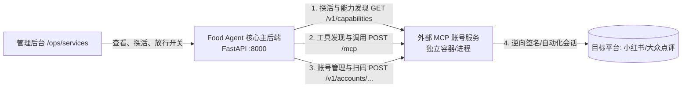

# Food Agent 外部数据源与 MCP 服务接入规范

本文档为第三方平台数据源（如小红书、大众点评、高德地图、美团等）或自建爬虫微服务接入 **Food Agent** 的标准对接规范。

只要你的独立微服务实现了本文档所规定的 **HTTP 控制面接口** 或 **MCP (Model Context Protocol) JSON-RPC 接口**，即可被 Food Agent 核心编排引擎自动发现、探活，并安全放行给大模型 Agent 规划执行。

---

## 1. 架构与边界说明

在 Food Agent 架构中，核心 Agent 与数据采集服务严格解耦：



### 核心分工与边界原则：
1. **主后端 (Food Agent)**：
   - 负责大模型 Prompt 编排、意图解析、跨源交叉验证、事实置信度评估、SSE 流式交互。
   - **不持有** 任何三方平台的明文 Cookie、账号密码、浏览器指纹或逆向签名算法。
2. **外部 MCP 账号服务 (Your Service)**：
   - 独立运行的 HTTP / MCP 服务（可使用 Python FastAPI、Node.js、Go 等任意技术栈）。
   - 自行持有 Playwright/Puppeteer 浏览器 Profile、Cookie 会话持久化、逆向加密 JS（Signer）等。
   - 对外仅暴露标准 HTTP 与 JSON-RPC 端点，所有凭据均使用**不透明标识符（Opaque References）**（如 `account_ref`, `flow_id`）。

---

## 2. 接口契约清单 (Contract Specifications)

系统支持三种接入协议模式（在配置中指定 `protocol`）：
- `http+mcp`（**推荐全功能模式**）：实现能力发现、账号生命周期和 MCP 工具调用。
- `mcp`（**轻量工具模式**）：仅实现 MCP JSON-RPC 端点（适用于无需账号登录态的纯查询服务）。
- `http`（**传统控制面模式**）：仅实现 HTTP 端点与 `/v1/source/invoke`。

---

### 2.1 HTTP 基础端点

#### ① 基础健康检查
- **方法**：`GET /health`
- **响应**：
  ```json
  {
    "status": "ok",
    "service_id": "xhs-service"
  }
  ```

#### ② 服务能力与元数据发现 (Capabilities)
主系统在启动或定时探活时调用该接口，用于确定服务支持的平台渠道和工具能力版本。
- **方法**：`GET /v1/capabilities`
- **响应格式**：
  ```json
  {
    "success": true,
    "data": {
      "service_id": "xhs-account-service",
      "service_version": "1.0.0",
      "contract_version": "account-service/v1",
      "protocol": "http+mcp",
      "platform_channels": ["xhs_pc"],
      "capabilities": [
        "account.register",
        "account.read",
        "account.login",
        "notes.search",
        "notes.detail",
        "comments.search"
      ],
      "login_modes": ["qr", "credential"],
      "expires_at": "2026-12-31T23:59:59Z",
      "refreshed_at": "2026-09-12T01:00:00Z",
      "mcp_endpoint": null
    }
  }
  ```
- **字段说明**：
  - `contract_version`：必须为 `"account-service/v1"`。
  - `platform_channels`：支持的平台渠道标识，可选值：`xhs_pc`, `xhs_creator`, `dianping`（或自定义 channel）。
  - `capabilities`：该服务提供的大致能力分类列表。
  - `mcp_endpoint`：若 MCP 端点与当前服务在不同路径或域名，可在此指定；为 `null` 时默认使用 `{base_url}/mcp`。

---

### 2.2 MCP JSON-RPC 端点 (`POST /mcp`)

服务端需暴露 `POST /mcp`，遵循 **JSON-RPC 2.0** 规范，处理以下 3 类请求：

#### ① `initialize`
- **请求 Payload**：
  ```json
  {
    "jsonrpc": "2.0",
    "id": 1,
    "method": "initialize",
    "params": {
      "protocolVersion": "2025-06-18",
      "capabilities": {},
      "clientInfo": {
        "name": "food-agent-core",
        "version": "1.0.0"
      }
    }
  }
  ```
- **响应**：
  ```json
  {
    "jsonrpc": "2.0",
    "id": 1,
    "result": {
      "protocolVersion": "2025-06-18",
      "capabilities": {
        "tools": {}
      },
      "serverInfo": {
        "name": "xhs-service",
        "version": "1.0.0"
      }
    }
  }
  ```
  *(可选：服务端可在 HTTP 响应头中返回 `Mcp-Session-Id: <session-id>`)*

#### ② `tools/list` (工具发现)
- **请求 Payload**：
  ```json
  {
    "jsonrpc": "2.0",
    "id": 2,
    "method": "tools/list"
  }
  ```
- **响应**：
  ```json
  {
    "jsonrpc": "2.0",
    "id": 2,
    "result": {
      "tools": [
        {
          "name": "notes.search",
          "description": "按关键词与城市检索小红书公开美食探店笔记列表",
          "capability": "notes.search",
          "side_effect": "read_only",
          "inputSchema": {
            "type": "object",
            "properties": {
              "keywords": {
                "type": "array",
                "items": { "type": "string" },
                "description": "搜索关键词列表"
              },
              "city": {
                "type": "string",
                "description": "目标城市，如广州、上海"
              },
              "limit": {
                "type": "integer",
                "default": 10
              }
            },
            "required": ["keywords"]
          }
        }
      ]
    }
  }
  ```
  > [!IMPORTANT]
  > **安全规则**：所有希望让大模型 Agent 自动规划和调用的工具，其 `side_effect` 属性必须明确声明为 `"read_only"`。带有写属性（`publish`, `upload`, `account_mutation` 等）的工具会被主后端的安全白名单自动拦截。

#### ③ `tools/call` (工具执行)
- **请求 Payload**：
  ```json
  {
    "jsonrpc": "2.0",
    "id": 3,
    "method": "tools/call",
    "params": {
      "name": "notes.search",
      "arguments": {
        "keywords": ["广州", "煲仔饭"],
        "city": "广州",
        "limit": 5
      }
    }
  }
  ```
- **响应**：
  ```json
  {
    "jsonrpc": "2.0",
    "id": 3,
    "result": {
      "content": [
        {
          "type": "json",
          "json": {
            "items": [
              {
                "note_id": "64f1a2b3c",
                "title": "老广推荐！西华路地道煲仔饭",
                "content": "锅巴酥脆，特调酱油非常香...",
                "liked_count": 1280,
                "poi_name": "超记煲仔饭(西华路店)"
              }
            ],
            "total": 1
          }
        }
      ],
      "isError": false
    }
  }
  ```

---

### 2.3 账号生命周期接口（可选，仅用于需要扫码授权的平台）

如果你的服务需要管理平台登录态并与前端的“扫码登录”对话框联动，需实现以下标准 REST 接口：

| 接口 | 方法 | 说明 |
| :--- | :--- | :--- |
| `/v1/accounts` | `POST` | 声明/注册账号引用（传入 `account_ref`, `alias`, `tenant_ref`） |
| `/v1/accounts/{platform}/{account_ref}` | `GET` | 查询账号当前健康态与登录态版本 |
| `/v1/accounts/{platform}/{account_ref}/login/qr` | `POST` | 发起二维码登录会话，返回 `flow_id` 与 `qr_expires_at` |
| `/v1/login/{flow_id}/qr` | `GET` | 获取二维码图片信息（返回 `object_ref` 与 `content_type`） |
| `/v1/login/{flow_id}/status` | `GET` | 查询扫码状态（`qr_ready` $\to$ `scanned` $\to$ `succeeded`） |
| `/v1/login/{flow_id}/poll` | `POST` | 轮询确认扫码结果并推进状态 |
| `/v1/login/{flow_id}/cancel` | `POST` | 取消当前的扫码会话 |

---

## 3. 核心红线安全契约（拦截机制）

主系统的网关（`validate_remote_payload`）运行着严格的数据安全防御机制。**违反以下任何一条，请求都会被直接抛出 HTTP 422 拒绝并记录告警**：

1. **绝对禁止传输明文凭据**：
   - 入参、返回的 JSON 或错误信息中，**严禁**包含以下命名的键或字符赋值：
     `cookie`, `token`, `authorization`, `bearer`, `password`, `storage_state`, `signer_state`, `browser_profile` 等。
2. **凭据仅留在微服务内部**：
   - 浏览器的 Cookie、Session、LocalStorage、加密算法等必须完全封装在你的外部微服务本地目录或内部数据库中。
   - 对外交互全部采用脱敏的业务标识：`account_ref`（如 `"acc_user_123"`）、`flow_id`（如 `"flow_qr_456"`）。
3. **错误信息结构化**：
   - 错误返回应使用标准错误类别（`RemoteErrorCategory`）：`dependency-unavailable`, `rate-limited`, `authentication`, `provider-risk` 等。

---

## 4. 极简 FastAPI 参考实现模板

如果你使用 Python FastAPI 开发外部 MCP 服务，可直接参考如下极简骨架（完整生产级实现可参考仓库内置的 [src/xhs_food/account_services/fixture.py](file:///g:/food-agent/src/xhs_food/account_services/fixture.py)）：

```python
from datetime import datetime, timedelta, timezone
from fastapi import FastAPI, HTTPException, Response
from pydantic import BaseModel

app = FastAPI(title="Custom MCP Service", version="1.0.0")

SERVICE_ID = "my-custom-service"

@app.get("/health")
async def health():
    return {"status": "ok", "service_id": SERVICE_ID}

@app.get("/v1/capabilities")
async def capabilities():
    now = datetime.now(timezone.utc)
    return {
        "success": True,
        "data": {
            "service_id": SERVICE_ID,
            "service_version": "1.0.0",
            "contract_version": "account-service/v1",
            "protocol": "http+mcp",
            "platform_channels": ["xhs_pc"],
            "capabilities": ["notes.search", "notes.detail"],
            "login_modes": ["qr"],
            "expires_at": (now + timedelta(hours=1)).isoformat(),
            "refreshed_at": now.isoformat(),
            "mcp_endpoint": None,
        }
    }

@app.post("/mcp")
async def mcp(body: dict, response: Response):
    method = body.get("method")
    req_id = body.get("id")

    if method == "initialize":
        response.headers["Mcp-Session-Id"] = f"{SERVICE_ID}-session"
        return {
            "jsonrpc": "2.0",
            "id": req_id,
            "result": {
                "protocolVersion": "2025-06-18",
                "capabilities": {"tools": {}},
                "serverInfo": {"name": SERVICE_ID, "version": "1.0.0"}
            }
        }
    elif method == "tools/list":
        return {
            "jsonrpc": "2.0",
            "id": req_id,
            "result": {
                "tools": [
                    {
                        "name": "notes.search",
                        "description": "按关键词搜索笔记",
                        "capability": "notes.search",
                        "side_effect": "read_only",
                        "inputSchema": {
                            "type": "object",
                            "properties": {
                                "keywords": {"type": "array", "items": {"type": "string"}}
                            },
                            "required": ["keywords"]
                        }
                    }
                ]
            }
        }
    elif method == "tools/call":
        params = body.get("params", {})
        tool_name = params.get("name")
        args = params.get("arguments", {})
        
        # 在此调用你的真实爬虫或查询逻辑
        sample_result = {"items": [{"title": "示例探店笔记", "score": 4.5}]}
        return {
            "jsonrpc": "2.0",
            "id": req_id,
            "result": {
                "content": [{"type": "json", "json": sample_result}],
                "isError": False
            }
        }
    
    return {"jsonrpc": "2.0", "id": req_id, "error": {"code": -32601, "message": "Method not found"}}
```

---

## 5. 如何在主系统中配置与接入？

### 步骤 1：启动你的独立服务
确保你的服务在本地或集群内正常运行，例如监听在 `http://127.0.0.1:8103`。

### 步骤 2：在主后端配置环境变量
在 Food Agent 根目录的 `.env` 中添加或追加 `MODULAR_ACCOUNT_SERVICES_JSON`：

```bash
MODULAR_ACCOUNT_SERVICES_JSON='[
  {
    "service_id": "my-custom-service",
    "base_url": "http://127.0.0.1:8103",
    "mcp_url": "http://127.0.0.1:8103/mcp",
    "protocol": "http+mcp",
    "channels": ["xhs_pc"],
    "capabilities": ["notes.search", "notes.detail"],
    "descriptor_version": "account-service/v1",
    "timeout_seconds": 10
  }
]'
```

### 步骤 3：在管理后台查看与放行
1. 启动/重启主后端：`uv run uvicorn api.main:app --port 8000`
2. 打开浏览器访问运营控制台：`http://localhost:5173/ops/services`
3. 可以在“服务目录”中看到刚加入的服务状态显示为 **READY**，点击进入详情即可查看发现的所有 MCP 工具，并支持在线进行沙箱连通性测试与一键放行开关！
