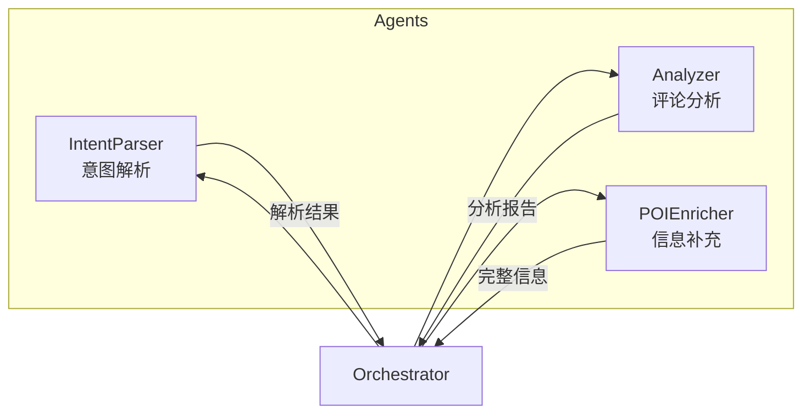

# 🤖 Agents 模块

**智能 Agent 组件** — XHS Food Agent 的核心大脑

---

## 📋 概述

本模块包含多个专业化的 AI Agent，协同工作完成美食推荐任务。每个 Agent 专注于特定职责，通过 Orchestrator 统一调度。

---

## 🏗️ 架构



---

## 📂 Agent 列表

| Agent | 文件 | 职责 |
|-------|------|------|
| **IntentParser** | `intent_parser.py` | 解析用户搜索意图，提取地点、美食类型、特殊需求 |
| **Analyzer** | `analyzer.py` | 分析评论内容，识别本地人推荐、过滤网红店 |
| **POIEnricher** | `poi_enricher.py` | 补充 POI 信息，获取详细地址、营业时间、联系方式 |

---

## 🔧 IntentParser - 意图解析 Agent

### 功能
- 解析自然语言搜索查询
- 提取结构化意图信息
- 生成多维度搜索关键词

### 输入/输出

```python
# 输入
"成都本地人常去的老火锅，要正宗的那种"

# 输出
{
    "location": "成都",
    "food_type": "火锅",
    "attributes": ["老店", "正宗", "本地人推荐"],
    "search_queries": [
        "成都老火锅 本地人推荐",
        "成都正宗火锅 隐藏美食",
        "成都火锅 老字号"
    ]
}
```

### 使用示例

```python
from xhs_food.agents import IntentParserAgent

parser = IntentParserAgent()
intent = await parser.parse("成都理工大学附近早餐")
print(intent.location)  # "成都理工大学附近"
print(intent.food_type)  # "早餐"
```

---

## 🔍 Analyzer - 评论分析 Agent

### 功能
- 分析小红书评论内容
- 评估评论权重（本地人 vs 游客）
- 识别网红营销内容
- 提取优缺点和推荐菜品

### 评分维度

| 维度 | 说明 |
|------|------|
| `trust_score` | 综合信任分 (0-10) |
| `local_ratio` | 本地用户评论占比 |
| `ad_score` | 广告嫌疑分数 |

### 使用示例

```python
from xhs_food.agents import AnalyzerAgent

analyzer = AnalyzerAgent()
result = await analyzer.analyze(notes, comments)

for shop in result.shops:
    print(f"{shop.name}: {shop.trust_score}")
```

---

## 📍 POIEnricher - 信息补充 Agent

### 功能
- 调用高德地图 API 补充 POI 信息
- 获取精确地址、电话、营业时间
- 计算距离信息
- 流式输出支持 SSE

### 使用示例

```python
from xhs_food.agents import POIEnricherAgent

enricher = POIEnricherAgent()

# 流式输出
async for restaurant in enricher.enrich_stream(shops, location):
    yield restaurant  # 逐个返回完整信息
```

---

## 🛠️ 扩展指南

### 创建新 Agent

1. 继承基础类或实现协议
2. 实现核心处理方法
3. 注册到 Orchestrator

```python
class CustomAgent:
    """自定义 Agent 模板"""
    
    def __init__(self, llm_service: LLMService):
        self.llm = llm_service
    
    async def process(self, input_data) -> OutputData:
        # 实现处理逻辑
        response = await self.llm.chat_completion(...)
        return self.parse_response(response)
```

---

## 📚 相关文档

- [Orchestrator 主编排器](../orchestrator.py)
- [LLM Service 服务](../services/llm_service.py)
- [Prompts 模板](../prompts/)
