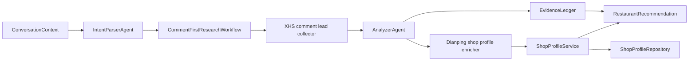

# Food Research Agent

`agents/` contains the semantic collaborators used by the single Food
Research workflow. Source access, persistence, and transport are deliberately
outside this package.

```mermaid
flowchart LR
    C[ConversationContext] --> I[IntentParserAgent]
    I --> W[CommentFirstResearchWorkflow]
    W --> X[XHS comment lead collector]
    X --> A[AnalyzerAgent]
    A --> E[EvidenceLedger]
    A --> D[Dianping shop profile enricher]
    D --> P[ShopProfileService]
    P --> Q[ShopProfileRepository]
    E --> R[RestaurantRecommendation]
    P --> R
```

## Responsibilities

| Component | Responsibility | Does not own |
| --- | --- | --- |
| `IntentParserAgent` | Resolves the current message plus bounded conversation history into `FoodSearchIntent`. | Follow-up categories, source calls, SQL |
| `AnalyzerAgent` | Interprets every collected comment, including disagreement and correction signals, then computes deterministic scores. | Provider schemas, shop profile writes |
| `CommentFirstResearchWorkflow` | Sequences the use case and applies budgets. It is the only Agent route. | MCP JSON parsing, HTTP, database details |

The workflow obtains its collaborators through constructor injection. XHS and
Dianping adapters implement the narrow ports in
`xhs_food.contracts.research`; the managed MCP session pins one catalog
snapshot for the complete run.

## Data ownership

- XHS comments are the primary discovery and reasoning evidence. The complete
  text, interaction fields, provider IDs, cursors, completeness, and raw
  responses are retained in `EvidenceLedger` and handed to the existing
  canonical evidence/bundle lifecycle.
- Dianping is a secondary enrichment source. It resolves the shop identity and
  contributes address, coordinates, phone, hours, images, dishes, prices,
  ratings, review counts, promotions, tags, and provider extensions. The
  normalized `ShopProfile` and its raw payload are persisted in `restaurants`.
- A profile refresh never replaces comment evidence. Missing or challenged
  provider calls become typed gaps and cannot erase previously stored fields.
- `ShopProfileService` checks the durable row first. Complete profiles are
  reused for the configured freshness window (default 7 days); partial profiles
  retry sooner (default 12 hours), and a failed refresh keeps the last profile.

## Conversation turns

Every turn enters `CommentFirstResearchWorkflow.execute()` with the same
`ConversationContext`. The parser sees the bounded transcript and the Agent
decides what the new message means; there is no separate result-list branch or
regular-expression follow-up handler.

## Extension rules

Add a source by implementing a port and its adapter under `research/`. Keep
provider-specific field mapping there, preserve the raw envelope, and expose
failure/completeness as `ResearchGap`. Do not import an MCP client, provider
URL, credential, SQL repository, or frontend type into an Agent class.
