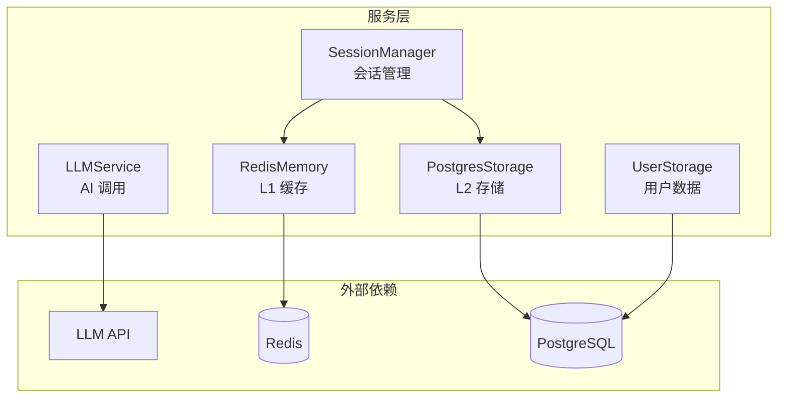
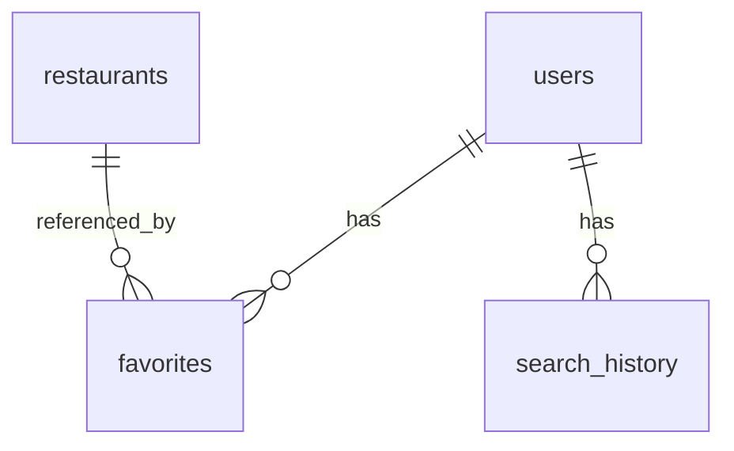

# 🔧 Services 模块

**核心服务层** — 提供存储、缓存、AI 调用等基础能力

---

## 📋 概述

Services 模块封装了所有基础设施交互逻辑，为上层 Agent 提供统一的服务接口。采用依赖注入设计，支持优雅降级。

---

## 🏗️ 架构



---

## 📂 服务列表

| 服务 | 文件 | 职责 |
|------|------|------|
| **LLMService** | `llm_service.py` | AI 模型调用，多模型支持 |
| **SessionManager** | `session_manager.py` | 会话统一管理，双写策略 |
| **RedisMemory** | `redis_memory.py` | L1 缓存，滑动窗口消息 |
| **PostgresStorage** | `postgres_storage.py` | L2 存储，向量检索 |
| **UserStorage** | `user_storage.py` | 用户数据，收藏/历史 |
| **Scoring** | `scoring.py` | 信任分数计算 |
| **Preprocessing** | `preprocessing.py` | 数据预处理 |

---

## 🤖 LLMService - AI 服务

### 功能
- 封装 OpenAI 兼容 API 调用
- 支持多模型切换与降级
- 统一错误处理

### 支持模型

| 提供商 | 模型 | 说明 |
|--------|------|------|
| SiliconFlow | Qwen3-8B | 默认推荐 |
| OpenAI | gpt-4o-mini | 备选 |
| DeepSeek | deepseek-chat | 备选 |

### 使用示例

```python
from xhs_food.services import LLMService

llm = LLMService(default_model="siliconflow_qwen3_8b")
response = await llm.chat_completion([
    {"role": "user", "content": "推荐成都火锅"}
])
```

---

## 🗂️ SessionManager - 会话管理

### 功能
- 统一管理 Redis 和 PostgreSQL
- 双写策略：同步 Redis + 异步 PostgreSQL
- 缓存预热：冷启动时从 PostgreSQL 恢复

### 读写流程

```
写入: 消息 → Redis (同步) → PostgreSQL (异步)
读取: Redis → [命中] → 返回
              → [未命中] → PostgreSQL → 缓存预热 → 返回
```

### 使用示例

```python
from xhs_food.services import SessionManager

session_mgr = SessionManager()

# 添加消息
await session_mgr.add_message(session_id, "user", "你好")

# 获取上下文
context = await session_mgr.get_context(session_id)
```

---

## 📦 RedisMemory - L1 缓存

### 功能
- 滑动窗口消息存储
- 24 小时 TTL 自动过期
- 优雅降级为内存 Dict

### Key 设计

| Key Pattern | 用途 |
|-------------|------|
| `session:{id}:window` | 滑动窗口消息 |

### 配置

```bash
REDIS_HOST=localhost
REDIS_PORT=6379
REDIS_DATABASE=0
REDIS_PASSWORD=
```

---

## 🗄️ PostgresStorage - L2 存储

### 功能
- 持久化对话历史
- pgvector 向量嵌入
- 语义相似度搜索

### 表结构

```sql
CREATE TABLE chat_history (
    id SERIAL PRIMARY KEY,
    session_id VARCHAR(255),
    role VARCHAR(20),
    content TEXT,
    embedding VECTOR(4096),
    created_at TIMESTAMPTZ
);
```

### 使用示例

```python
from xhs_food.services import PostgresStorage

storage = PostgresStorage()

# 保存消息 (自动生成向量)
await storage.save_message(session_id, "user", content)

# 语义搜索
similar = await storage.search_similar(query_embedding, top_k=5)
```

---

## 👤 UserStorage - 用户数据

### 功能
- 用户信息管理
- 收藏功能
- 搜索历史
- 软删除支持

### 表关系



---

## ⚙️ 配置汇总

```bash
# Redis (可选，降级为内存)
REDIS_HOST=localhost
REDIS_PORT=6379

# PostgreSQL (必选)
POSTGRES_HOST=localhost
POSTGRES_PORT=5432
POSTGRES_DB=food_agent
POSTGRES_USER=postgres
POSTGRES_PASSWORD=

# LLM API
OPENAI_API_KEY=sk-xxx
OPENAI_API_BASE=https://api.siliconflow.cn/v1/

# Embedding (可选)
EMBEDDING_API_KEY=
EMBEDDING_MODEL=text-embedding-3-small
```

---

## 📚 相关文档

- [Orchestrator 编排器](../orchestrator.py)
- [会话架构](../../../internal-docs/session_architecture.md)
- [存储架构](../../../internal-docs/STORAGE_ARCHITECTURE.md)
