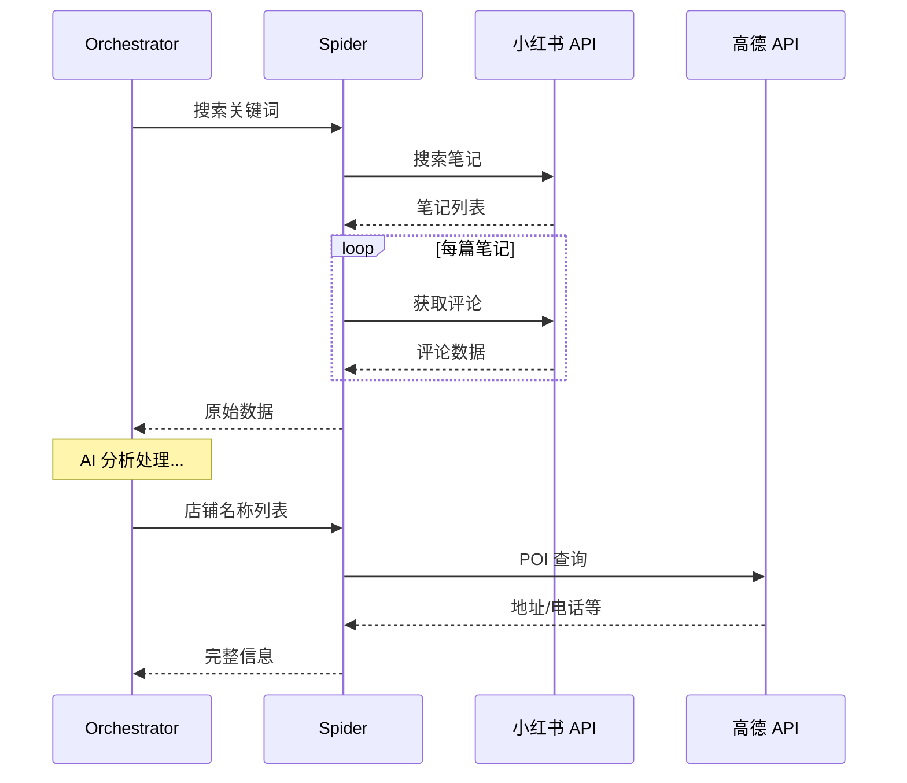

# 🕷️ Spider 模块

**小红书数据采集** — 基于逆向工程的笔记与评论爬虫

---

## 📋 概述

Spider 模块负责从小红书平台采集笔记和评论数据，为 AI 分析提供原始素材。本模块基于 [Spider_XHS](https://github.com/cv-cat/Spider_XHS) 开源项目改造。

---

## ⚠️ 重要声明

> [!CAUTION]
> **本模块仅供学习研究使用**
> 
> 使用本模块时请遵守：
> - 小红书服务条款和使用规范
> - 相关法律法规
> - 合理的请求频率限制
> 
> 请勿用于商业用途或损害平台利益的行为。

---

## 🏗️ 目录结构

```
spider/
├── apis/                 # API 封装
│   ├── xhs_api.py       # 小红书 API
│   └── amap_api.py      # 高德地图 API
├── core/                 # 核心功能
│   ├── sign.py          # 签名算法
│   └── session.py       # 会话管理
├── services/             # 业务服务
│   └── search_service.py # 搜索服务封装
├── xhs_utils/            # 工具函数
│   ├── cookies.py       # Cookie 管理
│   └── sign_utils.py    # 签名工具
└── static/               # 静态资源
```

---

## 🔧 核心功能

### 1. 笔记搜索

```python
from xhs_food.spider.services import SearchService

service = SearchService()
notes = await service.search_notes("成都火锅推荐", limit=20)

for note in notes:
    print(f"标题: {note.title}")
    print(f"作者: {note.author}")
    print(f"点赞: {note.likes}")
```

### 2. 评论获取

```python
comments = await service.get_comments(note_id)

for comment in comments:
    print(f"{comment.user}: {comment.content}")
```

### 3. 高德 POI 查询

```python
from xhs_food.spider.apis import AmapAPI

amap = AmapAPI()
poi = await amap.search_poi("蜀大侠火锅", city="成都")

print(f"地址: {poi.address}")
print(f"电话: {poi.tel}")
print(f"营业时间: {poi.business_hours}")
```

---

## ⚙️ 配置

### Cookie 配置

在 `.env` 中配置小红书登录 Cookie：

```bash
XHS_COOKIES="web_session=xxx; a1=xxx; ..."
```

### 获取 Cookie 方式

1. 打开浏览器登录小红书
2. F12 打开开发者工具
3. 找到 Network → 请求头 → Cookie
4. 复制完整 Cookie 值

### 高德地图 API

```bash
AMAP_API_KEY=your_amap_key
```

---

## 📊 请求限制

为避免被封禁，内置了请求频率控制：

| 操作 | 默认间隔 | 说明 |
|------|----------|------|
| 搜索 | 1-2s | 随机延迟 |
| 详情 | 0.5-1s | 随机延迟 |
| 评论 | 0.5-1s | 随机延迟 |

---

## 🔄 数据流



---

## 🛠️ 开发指南

### 添加新 API

1. 在 `apis/` 创建新文件
2. 实现 API 客户端类
3. 在 `__init__.py` 导出

```python
# apis/new_api.py
class NewAPI:
    def __init__(self):
        self.base_url = "https://api.example.com"
    
    async def fetch_data(self, params):
        # 实现请求逻辑
        pass
```

### 更新签名算法

小红书可能更新反爬策略，签名算法需要同步更新：

```python
# core/sign.py
def generate_sign(params: dict) -> str:
    # 更新签名逻辑
    pass
```

---

## 🙏 致谢

本模块的核心数据采集能力基于以下开源项目：

<table>
<tr>
<td align="center">
<a href="https://github.com/cv-cat/Spider_XHS">
<b>Spider_XHS</b>
</a>
<br/>
<sub>小红书逆向爬虫 · 感谢 <a href="https://github.com/cv-cat">@cv-cat</a> 的辛勤付出 ❤️</sub>
</td>
</tr>
</table>

---

## 📚 相关文档

- [Orchestrator 编排器](../orchestrator.py)
- [POI Enricher Agent](../agents/poi_enricher.py)
